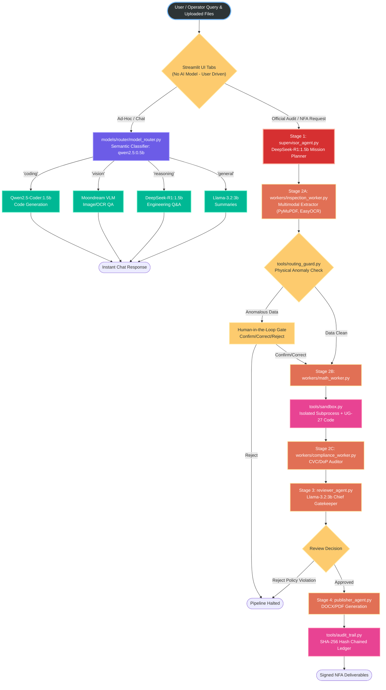
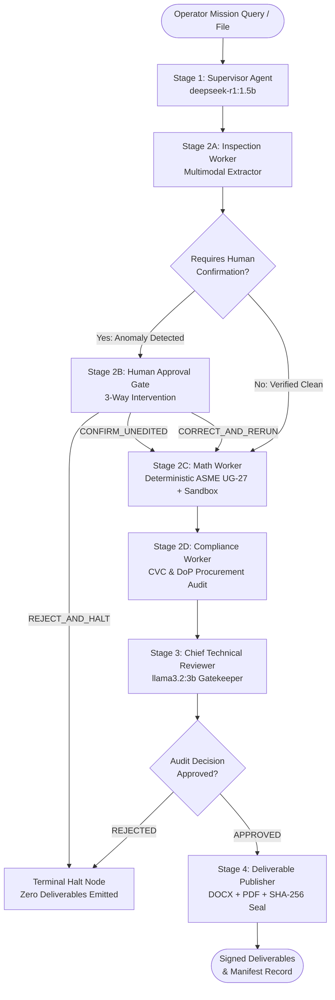

# AegisForge-AI: Sovereign Air-Gapped Multi-Agent AI Workbench for PSUs & Critical Infrastructure

> **Self-hosted, air-gapped agentic AI workbench running entirely on on-premises infrastructure with zero data leakage, deterministic engineering math, and statutory CVC/DoP compliance.**

[](https://www.python.org/)
[](https://github.com/langchain-ai/langgraph)
[](#)
[](#)
[](https://ollama.com/)
[-brightgreen.svg)](#)
[](#)
[](LICENSE)

---

## Executive Summary

Public Sector Undertakings (PSUs) such as **IOCL, ONGC, BPCL, HPCL, GAIL, NTPC**, defense manufacturing units (**DRDO, HAL, BEL**), and statutory safety directorates (**PESO, OISD, CVC**) handle confidential operational data, ultrasonic thickness survey grids, and high-value procurement notes. None of this sensitive IP can ever be transmitted to public cloud LLMs due to national data sovereignty laws, corporate air-gap mandates, and life-safety liabilities.

**AegisForge-AI** provides an industrial-grade, fully sovereign, multi-agent AI workbench that runs **100% on-premises** with **zero external network calls** — verified through real-time passive network telemetry auditing.

## Global System Architecture Map



---

## Core Features — What's Built & How It Works

### 1. ⚙️ The "Dual-Engine" Philosophy (Trust & Reasoning)
Industrial users often distrust AI for critical engineering math. AegisForge-AI addresses this with a Dual-Engine architecture, explicitly separated in the Streamlit UI:
- **Engine 1: 🧮 ASME Calculator (Zero-AI Zone):** A pure, deterministic Python math engine that evaluates statutory ASME UG-27 and API 510 equations. No LLMs are used here, ensuring 100% reproducible and trustworthy math.
- **Engine 2: 💬 AI Workbench (Agentic Copilot):** A contextual reasoning engine powered by specialized local SLMs (DeepSeek, Qwen). It uses the ASME Calculator as a backend tool to get the hard numbers, and then generates the statutory compliance reasoning (e.g., CVC Circular analysis).

### 2. 🧠 Multi-Agent Orchestration & Agentic Workflow (LangGraph StateGraph)

AegisForge-AI coordinates a sovereign **4-stage multi-agent pipeline** built on [LangGraph](https://github.com/langchain-ai/langgraph). Specialized local LLMs, deterministic calculation engines, statutory compliance auditors, and human operators collaborate through a strictly typed state machine (`MultiAgentSystemState`).

#### 📐 End-to-End Agentic Workflow Architecture



#### 🔄 Detailed Breakdown of the 4 Stages

1. **Stage 1: Mission Planning & Intent Decomposition (`Supervisor Agent`)**
   - **Model / Engine**: Local reasoning LLM (`deepseek-r1:1.5b`).
   - **Function**: Ingests the operator's mission query and attached asset files (inspection spreadsheets, UT grids, NDT reports). Decomposes the operational objective into a 5-step industrial execution plan.
   - **Why Reasoning Matters**: Unlike standard conversational chatbots, DeepSeek-R1 provides chain-of-thought analysis to untangle complex PSU plant scenarios without hallucinating execution paths.
   - **Fail-Fast Outage Protection**: If the local Ollama inference service is offline, the Supervisor immediately triggers an explicit fail-fast halt (`HALTED_OLLAMA_SERVICE_UNAVAILABLE`), preventing unverified heuristic fallbacks.

2. **Stage 2: Specialized Workers, Deterministic Math & Human-in-the-Loop Gate**
   - **2A. Inspection Worker (`inspection_worker.py`)**: Universal multimodal extractor using EasyOCR, PyMuPDF, and python-docx. Ingests UT thickness grids, design pressure ($P$), design temperature ($T$), allowable stress ($S$), joint efficiency ($E$), and corrosion allowance ($CA$).
   - **2B. Routing Guard & 3-Way Human Approval Gate (`routing_guard.py`)**: Evaluates extracted parameters against physical sanity thresholds (e.g., thickness > 300 mm, corrosion rate > 3.0 mm/yr). If anomalous or unphysical data is detected, the pipeline **halts** (`GATE_WAITING_HUMAN`) and presents the operator with three actions:
     - `CONFIRM_UNEDITED`: Operator confirms original sensor reading as valid; proceeds to Math Worker.
     - `CORRECT_AND_RERUN`: Operator injects corrected engineering values (protected against subsequent re-extraction overwrite) and resumes computation.
     - `REJECT_AND_HALT`: Operator rejects invalid survey; terminates pipeline safely with zero deliverables.
   - **2C. Math Worker (`math_worker.py` & `ug27_core.py`)**: Enforces the **Zero Math Hallucination Rule**. LLMs are strictly forbidden from performing arithmetic. Calculates required thickness ($t_{req}$), derated MAWP, remaining corrosion life, and delta margin ($\Delta = t_{actual} - t_{req}$). Categorizes the structural verdict into `CRITICAL_BREACH` ($\Delta < 0.0$), `MARGINAL_ALERT` ($\Delta = 0.0$), or `SAFE` ($\Delta > 0.0$).
   - **2D. Compliance Worker (`compliance_worker.py`)**: Enforces statutory CVC Circular 02/02/2004 and IOCL Delegation of Powers (DoP) Clause 4.2. **Strict Causal Dependency**: Only executes *after* the Math Worker completes. If $\Delta \ge 0.0$ mm (vessel is structurally sound), any emergency single-source procurement is flagged with `NON_COMPLIANT_CVC_VIOLATION` and rejected. Also cross-checks Proprietary Article Certificate (PAC) validity against a verified registry.

3. **Stage 3: Cross-Domain Holistic Audit (`Chief Technical Reviewer`)**
   - **Model / Engine**: Local fast instruction-tuned LLM (`llama3.2:3b`).
   - **Function**: Serves as the executive gatekeeper across all domains: verifies that ASME formulas match raw inputs, confirms CVC/DoP audit conclusions, and checks passive air-gap network telemetry.
   - **Conditional Gating**:
     - If all statutory criteria pass: routes state to the Deliverable Publisher.
     - If any integrity or compliance check fails: immediately routes to `halt_node`, recording an immutable audit event and preventing generation of unauthorized procurement notes.

4. **Stage 4: Cryptographic Deliverable Generation (`Deliverable Publisher`)**
   - **Function**: Compiles court-admissible, production-grade Microsoft Word (`.docx`) and Adobe PDF (`.pdf`) Notes for Approval (NFAs).
   - **Provenance & Integrity**: Calculates a SHA-256 digital signature of each deliverable, updates `deliverable_manifest.json`, and records the complete session run into the tamper-evident, append-only hash-chained ledger (`audit_ledger.jsonl`).

#### 🏭 Real-Life Industrial Scenario: "The 11-V-102 Separator Vessel Incident"

*Let's walk through a practical scenario where a refinery engineer uses AegisForge-AI to audit a pressure vessel.*

1. **The Scenario**: An inspection engineer uploads a scanned PDF of an Ultrasonic Thickness (UT) survey for a Crude Distillation Unit (CDU) separator vessel (Equipment ID: `11-V-102`). The engineer types: *"Check if this vessel is safe to operate, and generate an emergency single-source procurement NFA if it has breached ASME code."*
2. **Stage 1 (Supervisor)**: DeepSeek-R1 reads the prompt, understands the dual intent (math calculation + potential procurement), and formulates the pipeline workflow.
3. **Stage 2A (Inspection Worker)**: The multimodal parser processes the PDF. It extracts: Design Pressure ($P$ = 3.5 MPa), Design Temp ($T$ = 250°C), Allowable Stress ($S$ = 138 MPa), and the latest UT measured thickness of **8.2 mm**.
4. **Stage 2B (Human Gate)**: The worker flags a sudden 2.5 mm drop in thickness in just one year (an anomalously high corrosion rate). The pipeline **HALTS**. The operator receives a UI alert and clicks `CONFIRM_UNEDITED` (confirming that localized severe H2S pitting actually occurred).
5. **Stage 2C (Math Worker)**: The deterministic sandbox executes ASME UG-27. It calculates the code-required minimum thickness ($t_{req}$) as **8.5 mm**. Since actual thickness (8.2 mm) is less than required (8.5 mm), it generates a `CRITICAL_BREACH` alert ($\Delta = -0.3$ mm).
6. **Stage 2D (Compliance Worker)**: Seeing the `CRITICAL_BREACH` flag, the compliance engine validates that emergency single-source procurement is legally justified under CVC rules. It checks the provided PAC ID against the registry and confirms it is active.
7. **Stage 3 (Reviewer Gatekeeper)**: Llama 3.2 audits the whole chain. It verifies that $8.2 < 8.5$ is mathematically sound, confirms the CVC rule applies accurately to a breach state, and checks the passive network telemetry for zero data leakage. It outputs `APPROVED`.
8. **Stage 4 (Publisher)**: The pipeline generates a formal, SHA-256 sealed PDF/DOCX Note for Approval, allowing the refinery director to immediately procure a replacement shell segment without violating PSU procurement statutes.

---

### 2. 🔢 Deterministic Engineering Math (ASME Section VIII Div 1 UG-27)

All pressure vessel calculations follow the **ASME Boiler and Pressure Vessel Code (BPVC)** standard — implemented as pure Python functions in `tools/ug27_core.py` with zero LLM involvement.

**Minimum Required Wall Thickness:**

$$t_{req} = \frac{P \times R}{S \times E - 0.6 \times P} + CA$$

Where:
- $P$ = Internal Design Pressure (MPa)
- $R$ = Inside Radius of Shell (mm)
- $S$ = Maximum Allowable Stress (MPa)
- $E$ = Joint Efficiency ($0.0 < E \le 1.0$)
- $CA$ = Specified Corrosion Allowance (mm)

**Derated Maximum Allowable Working Pressure (MAWP):**

$$P_{MAWP} = \frac{S \times E \times t_{actual}}{R + 0.6 \times t_{actual}}$$

**Margin Analysis & Boundary Decisions:**
- $\Delta = t_{actual} - t_{req}$
- If $\Delta < 0.0$: **`CRITICAL_BREACH`** — mandatory statutory code violation, emergency single-source procurement permitted.
- If $\Delta = 0.0$: **`MARGINAL_ALERT`** — zero safety margin, flagged for operational review.
- If $\Delta > 0.0$: **`SAFE`** — vessel meets code minimum, emergency procurement is blocked.

**Why LLMs don't compute:**
LLMs are statistical text generators — they can approximate arithmetic but regularly produce subtle errors (e.g., rounding, operator precedence mistakes). In pressure vessel engineering, a 0.1mm error in wall thickness can mean the difference between operational safety and catastrophic failure. AegisForge-AI enforces **strict tool passthrough**: LLMs handle text synthesis only, while `ug27_core.py` handles all math.

---

### 3. 📊 Multi-Point Ultrasonic Thickness Grid Analyzer

The `tools/thickness_grid_analyzer.py` processes multi-point ultrasonic thickness (UT) survey grids — the standard method for assessing corrosion damage across pressure vessel shells.

**How it works:**
- Accepts a grid of thickness readings at multiple inspection locations (e.g., BK-01 through BK-06).
- Runs independent ASME UG-27 calculations at each grid point.
- Identifies the **worst-case breach location** with the minimum delta.
- Generates a statistical summary: mean thickness, standard deviation, min/max, and per-point verdicts.

---

### 4. ⚖️ Statutory CVC & DoP Procurement Compliance Engine

The `tools/compliance_auditor.py` enforces **Central Vigilance Commission (CVC)** guidelines and **IOCL Delegation of Powers (DoP)** statutes for emergency procurement.

**How it works:**
- Validates that emergency single-source procurement is only permitted when a genuine structural breach exists ($\Delta < 0.0$ mm).
- Cross-references **Proprietary Article Certificate (PAC)** identifiers against a verified registry with expiration dates.
- Enforces **IOCL DoP Clause 4.2** financial delegation thresholds (₹20 Lakhs, ₹50 Lakhs, ₹1 Crore).
- Any hallucinated, expired, or unverifiable PAC triggers `EXPIRED_PAC_VIOLATION` or `UNVERIFIED_PAC_PROVIDER`, halting the pipeline.

**Why this matters:**
In Indian PSUs, single-source procurement without proper justification is a CVC audit violation that can result in disciplinary proceedings. AegisForge-AI makes it **computationally impossible** to generate a single-source procurement note for a structurally safe vessel.

---

### 5. 🛡️ 3-Way Human Approval Gate with Recovery

When the Inspection Worker detects anomalous or unphysical readings (e.g., corrosion rate > 3.0 mm/yr, thickness > 300 mm), the pipeline halts at a **Human Approval Gate** with three options:

| Action | Effect |
|---|---|
| `CONFIRM_UNEDITED` | Accept original values, proceed to Math Worker |
| `CORRECT_AND_RERUN` | Inject corrected values (protected from re-extraction overwrite), rerun pipeline |
| `REJECT_AND_HALT` | Stop pipeline completely, no deliverables generated |

Every human intervention is recorded in the **SHA-256 hash-chained audit ledger** as an immutable, tamper-evident entry.

---

### 6. 🔍 Sovereign Multimodal RAG (Qdrant Vector Database)

The `database/qdrant_manager.py` provides a **fully local, embedded Qdrant vector database** — no Docker, no network sockets, no cloud APIs.

**How it works:**
- Uses **CLIP ViT-B/32** dual encoders (text + vision) via `fastembed` to map documents and images into the same 512-dimensional vector space.
- Supports **hybrid retrieval**: dense semantic vector search combined with indexed keyword payload filtering.
- Ingests documents via `ingestion/multimodal_parser.py`: PDF (PyMuPDF), DOCX (python-docx), TXT, MD, JSON, and standalone images (PNG/JPG).
- Enriches every chunk with domain-specific keyword tags: equipment IDs, ASME codes, NDT methods, defect types, and materials.
- Falls back to lexical search over `sample_data/` if the Qdrant collection is empty.

**Why Qdrant over ChromaDB/FAISS:**
Qdrant provides native payload indexing (keyword filtering without vector math), embedded local execution without Docker, and true multimodal alignment through CLIP embeddings — critical for industrial use cases where engineering diagrams and text must be jointly searchable.

---

### 7. 🏗️ Multimodal Document Ingestion Pipeline

The `ingestion/multimodal_parser.py` is a universal document parser that extracts structured data from:

| Format | Engine | Extraction |
|---|---|---|
| PDF (.pdf) | PyMuPDF (fitz) | Text blocks, tables, embedded images |
| Word (.docx) | python-docx | Paragraphs, tables, embedded images |
| Plain Text (.txt, .md) | Built-in | Chunked text with keyword tagging |
| JSON (.json) | Built-in | Structured key-value extraction |
| Images (.png, .jpg, .tiff) | EasyOCR (CRAFT + CRNN) | Offline OCR text recognition |

Every extracted chunk is automatically enriched with domain-specific regex patterns for equipment IDs, ASME codes, NDT methods, defect types, and materials.

---

### 8. 📄 Native Document Compilers (DOCX + PDF)

AegisForge-AI generates **native Microsoft Word (.docx)** and **Adobe PDF (.pdf)** Notes for Approval — not HTML-to-PDF conversions, but proper structured documents.

- **DOCX Compiler** (`output_generation/docx_generator.py`): Uses `python-docx` to produce formatted approval notes with headers, tables, engineering data, and executive summaries.
- **PDF Compiler** (`output_generation/pdf_generator.py`): Uses `ReportLab` to generate typeset PDF documents with tables, formatted calculations, and digital attestation blocks.
- Both outputs include **SHA-256 cryptographic hashes** registered in a `deliverable_manifest.json` for tamper detection.

---

### 9. 🔒 Cryptographic SHA-256 Hash-Chained Audit Ledger

The `tools/audit_trail.py` provides a **tamper-evident, append-only JSONL audit ledger** where every event is cryptographically chained.

**How it works:**
- Each entry's hash is computed as: `SHA256(previous_hash + canonical_json(payload))`
- The first entry chains from a genesis hash (`0x00...00`).
- Any modification, deletion, or insertion breaks the hash chain and is immediately detectable.
- Every tool execution, human override, compliance audit, and deliverable generation is logged.

---

### 10. 🌐 Passive Air-Gap Network Telemetry Auditor

The `tools/network_verifier.py` proves the sovereign air-gap claim through **passive inspection of active network sockets** — without transmitting any outbound packets.

**Two audit scopes:**
- **Process-tree scope**: Inspects only the Python agent's process tree and child subprocesses. Verifies 0 non-loopback connections.
- **Host-level scope**: Audits all OS-level network sockets system-wide.

The verifier distinguishes loopback connections (127.0.0.1, ::1) from external connections and reports `PASS_PROCESS_AIR_GAP_VERIFIED` or `ALERT_HOST_EXTERNAL_CONNECTIONS_DETECTED`.

---

### 11. 🔐 Air-Gapped Python Code Sandbox

The `tools/sandbox.py` module provides a hardened, air-gapped computational execution environment designed to run Python math and data-transformation scripts without endangering the host operating system or main agent runtime.

#### ❓ What is the Sandbox?
An isolated code execution jail that allows AegisForge-AI to dynamically execute ad-hoc mathematical calculations, statistical modeling, and data parsing routines. Rather than executing code directly within the primary Python interpreter, the sandbox quarantines and inspects all scripts before and during runtime.

#### 🎯 Why is it needed?
1. **Preventing LLM Hallucinated Math**: While standard ASME equations live in `tools/ug27_core.py`, specialized calculations (such as regression curves on multi-point UT grids or custom unit conversions) often require code execution. LLMs are notorious for mathematical hallucination when computing purely in text; the sandbox provides an environment for deterministic Python math execution.
2. **Defending Against Remote Code Execution (RCE) & Prompt Injections**: In PSU, refinery, and defense environments, untrusted document uploads (PDFs, inspection sheets, PAC certificates) could contain adversarial prompt injection payloads designed to execute arbitrary shell commands (`os.system("rm -rf ...")`), open network exfiltration sockets, or access confidential local files.
3. **Guarding Host Stability & Mitigating Resource Starvation**: LLM-generated code could inadvertently include infinite loops (`while True`), recursive memory allocation bombs (`" " * 10**10`), or hung subprocesses. The sandbox enforces strict ceilings on CPU time, RAM, and terminal buffer output.

#### 🛡️ How does it work? (3-Layer Security Architecture)

```
       [ Input Python Code ]
                 │
                 ▼
┌─────────────────────────────────┐
│ Layer 1: Static AST Allowlist   │  ──▶ Blocks unapproved imports (os, sys, socket, urllib)
│          & Syntax Gatekeeper    │  ──▶ Rejects dunders (__class__, __subclasses__, __globals__)
└─────────────────────────────────┘  ──▶ Forbids dangerous builtins (eval, exec, open, compile)
                 │ (Passed)
                 ▼
┌─────────────────────────────────┐
│ Layer 2: Subprocess Isolation   │  ──▶ Writes to isolated scratch file in data/scratch/
│                                 │  ──▶ Executes in isolated child process via sys.executable
└─────────────────────────────────┘
                 │
                 ▼
┌─────────────────────────────────┐
│ Layer 3: Active Watchdog Limits │  ──▶ Memory Watchdog: 512 MB ceiling via psutil
│          & Ledger Auditing      │  ──▶ Execution Timeout: 10s hard cap
└─────────────────────────────────┘  ──▶ Output Buffer: 8,000 char cap
                 │                   ──▶ Cryptographic Audit: SHA-256 event logged
                 ▼
       [ Execution Result ]
```

1. **Layer 1: Static AST (Abstract Syntax Tree) Verification (Pre-Execution)**
   - **Strict Import Allowlist**: The code is parsed into an AST before execution. Only safe, purely computational standard libraries are allowed: `math`, `statistics`, `json`, `re`, `datetime`, `decimal`, `fractions`, `itertools`, `csv`, `collections`, `random`. Any import of `os`, `sys`, `subprocess`, `socket`, `urllib`, `requests`, or `shutil` raises a `SandboxSecurityError` immediately.
   - **Private & Dunder Attribute Shield**: Rejects any attribute starting with an underscore `_` (e.g., `__class__`, `__subclasses__`, `__globals__`, `__bases__`), blocking Python sandbox escape gadget chains.
   - **Dangerous Builtin Call Interception**: Strictly prohibits calls to `eval`, `exec`, `open`, `compile`, `type`, `getattr`, `setattr`, `delattr`, `breakpoint`, `input`, `globals`, `locals`, and `__import__`.

2. **Layer 2: Isolated Subprocess Execution**
   - Scripts that pass AST verification are written to a designated scratch file in `data/scratch/` and executed in a dedicated, isolated child process using `sys.executable`.
   - The child process runs completely decoupled from the main LangGraph agent runtime; a crash or memory fault cannot corrupt the main application state.

3. **Layer 3: Active Resource Watchdog & Limits**
   - **Hard Memory Ceiling (512 MB)**: A background monitoring thread uses `psutil` to track the RSS memory consumption of the child process. If the process exceeds 512 MB, it is instantly terminated (`MEMORY_LIMIT_EXCEEDED`).
   - **Hard Timeout (10 seconds default)**: Subprocess execution is capped at 10 seconds to eliminate infinite loops and CPU hogging.
   - **Output Truncation (8,000 chars)**: Standard output and standard error streams are capped at 8,000 characters to prevent buffer overflow attacks and terminal denial-of-service.
   - **Cryptographic Audit Ledger Anchoring**: Every execution attempt—whether successful, rejected at AST inspection, timed out, or memory-killed—is hashed and immutably appended to `audit_ledger.jsonl`.

---

### 12. 🤖 Dynamic Model Router

The `models/router/model_router.py` classifies incoming prompts and routes them to the optimal local model:

| Task Type | Model | Use Case |
|---|---|---|
| Coding & Automation | Qwen2.5-Coder 1.5B | Python scripts, SQL, SCADA/Modbus parsers |
| Reasoning & Compliance | DeepSeek-R1 1.5B | ASME analysis, NFA justifications, CVC compliance |
| Visual & Schematic QA | Moondream (VLM) | P&ID drawings, engineering schematics, OCR |
| General Text & Summaries | Llama 3.2 3B | Fast text processing, summaries, documentation |

All models run locally via [Ollama](https://ollama.com/) with weights stored in `model_pool/` — zero cloud API calls.

---

### 13. 🖥️ Streamlit Web Dashboard

A production-grade web interface (`frontend/app.py`) with three focused tabs:

- **AI Workbench**: Chat interface with dynamic model routing, file upload, and NFA document generation.
- **ASME Code Calculator**: Interactive pressure vessel calculator with real-time results and downloadable DOCX/PDF reports.
- **Model Hub**: Download, verify, and manage local AI model weights with progress tracking.

---

## Installation Guide

### Prerequisites

| Requirement | Minimum | Recommended |
|---|---|---|
| **Python** | 3.11 | 3.12 |
| **RAM** | 8 GB | 16 GB |
| **Disk Space** | 15 GB (for models) | 25 GB |
| **GPU (optional)** | Any NVIDIA GPU with 4GB+ VRAM | RTX 3050+ / RTX 4060+ |
| **OS** | Windows 10/11, Ubuntu 22.04+ | Windows 11 |

> **Note:** AegisForge-AI runs on both **CPU-only** and **GPU** systems. GPU acceleration significantly speeds up EasyOCR and PyTorch operations but is not required.

### Step 1: Clone the Repository

```bash
git clone https://github.com/Shivanshvyas1729/AegisForge-AI.git
cd AegisForge-AI
```

### Step 2: Create a Virtual Environment

```bash
# Using uv (recommended — fast)
uv venv .venv
# Activate:
# Windows PowerShell:
.venv\Scripts\activate
# Linux/macOS:
source .venv/bin/activate

# --- OR using standard venv ---
python -m venv .venv
# Activate as above
```

### Step 3: Install PyTorch (CPU or GPU)

Choose **one** of the following based on your system:

**Option A — NVIDIA GPU (CUDA 12.4):**
```bash
pip install torch torchvision torchaudio --index-url https://download.pytorch.org/whl/cu124
```

**Option B — CPU Only (no NVIDIA GPU):**
```bash
pip install torch torchvision torchaudio --index-url https://download.pytorch.org/whl/cpu
```

> **How to check:** Run `nvidia-smi` in your terminal. If it shows your GPU name and driver version, use Option A. If it errors out, use Option B.

### Step 4: Install Project Dependencies

```bash
pip install -r requirements.txt
```

### Step 5: Install & Configure Ollama

1. Download and install [Ollama](https://ollama.com/download) for your OS.
2. Pull the required models:

```bash
ollama pull deepseek-r1:1.5b       # Reasoning & ASME compliance (~1.1 GB)
ollama pull qwen2.5-coder:1.5b     # Code generation & automation (~1.0 GB)
ollama pull llama3.2:3b             # Fast text & summaries (~2.0 GB)
ollama pull moondream               # Visual/schematic QA (~1.7 GB)
```

Or use the built-in model downloader:
```bash
python main.py download-models
```

### Step 6: Seed the Knowledge Base (Optional)

```bash
python scripts/init_qdrant_db.py
```

This scans `sample_data/` and `data/uploads/`, parses all documents, and ingests them into the local Qdrant vector database.

### Step 7: Launch the Application

```bash
# Launch the Streamlit Web Dashboard
streamlit run frontend/app.py

# --- OR use the CLI ---
python main.py              # Interactive terminal menu
python main.py status       # System health & model status
python main.py ui           # Launch Streamlit dashboard
```

### Step 8: Verify Installation

```bash
# Run the sovereign toolset test suite (no Ollama required)
python tests/test_sovereign_toolset.py

# Run the multi-agent integration tests (requires Ollama + DeepSeek-R1)
python tests/test_multi_agent_system.py
```

---

## Comprehensive Verification & Test Suite

Both automated test suites pass with **100% success (18 / 18 Tests Passing)**:

### 1. Sovereign Toolset Verification (`tests/test_sovereign_toolset.py`)

```text
  [PASS] Test 01: All 9 tools exported cleanly without import errors.
  [PASS] Test 02: ASME UG-27 baseline math, breach detection, zero-margin alert, & boundary failure modes.
  [PASS] Test 03: AST allowlist sandbox blocks OS, socket, subprocess, urllib, & infinite loops.
  [PASS] Test 04: File I/O strictly blocks relative path traversal attacks (../../escape).
  [PASS] Test 05: Multi-point thickness grid analyzer audits 6 points, pinpoints worst breach location.
  [PASS] Test 06: CVC compliance engine rejects unsubstantiated PAC and hallucinated PAC identifiers.
  [PASS] Test 07: Inspection extractor triggers ACTION_REQUIRED_UNVERIFIED_DATA on unphysical readings.
  [PASS] Test 08: Cryptographic audit ledger maintains unbroken SHA-256 chain and catches byte tampering.
  [PASS] Test 09: Network verifier confirms 0 open non-loopback external sockets on process tree.
  [PASS] Test 10: Deliverables generated in DOCX & PDF format with SHA-256 manifest registration.
  [PASS] Test 11: Routing guard halts dispatch awaiting human confirmation on flagged anomalies.
```

### 2. Multi-Agent Orchestration Integration (`tests/test_multi_agent_system.py`)

```text
  [PASS] Test 01: Golden Path End-to-End (Supervisor → Inspection → Math → Compliance → Reviewer → Publisher).
  [PASS] Test 02: Anomaly Gating & Halting (Pipeline halts cleanly with status=GATE_WAITING_HUMAN).
  [PASS] Test 03: Human Approval Recovery (CORRECT_AND_RERUN injects values, anchors SHA-256 ledger block).
  [PASS] Test 04: Human Approval Recovery (CONFIRM_UNEDITED authorizes calculation on original values).
  [PASS] Test 05: Compliance Causal Dependency (Safe vessel delta=+16.43 mm rejects emergency single-source).
  [PASS] Test 06: PAC Expiry Rejection (Chief Reviewer gatekeeper halts on expired PAC certificate).
  [PASS] Test 07: Local Ollama Outage Fail-Fast Check (Halts with HALTED_OLLAMA_SERVICE_UNAVAILABLE).
```

---

## Architectural & Governance Guarantees

| Guarantee | Enforcement Mechanism | Failure / Violation Behavior |
| :--- | :--- | :--- |
| **Zero Math Hallucination** | LLMs restricted to parsing/synthesis. All calculations via `tools/ug27_core.py`. | LLMs cannot compute or alter numerical values. |
| **Causal Compliance** | `ComplianceWorker` consumes validated `calculation_data`. | Emergency single-source rejected with `NON_COMPLIANT_CVC_VIOLATION` if $\Delta \ge 0.0$ mm. |
| **PAC Registry Verification** | PAC certificates checked against `VERIFIED_PAC_REGISTRY` with expiration dates. | Hallucinated/expired PACs trigger `EXPIRED_PAC_VIOLATION`. |
| **Conservative Parameter Guard** | Joint efficiency ($E$) and corrosion allowance ($CA$) are mandatory in `routing_guard.py`. | Dispatch blocked if non-conservative defaults assumed without verification. |
| **3-Way Human Gate Recovery** | Operator can confirm, correct, or reject. Corrected values protected from re-extraction. | Halted pipeline recovers cleanly with audit trail block hash. |
| **Process-Tree Air Gap** | `network_verifier.py` inspects active Python process sockets passively. | Reports `PASS_PROCESS_AIR_GAP_VERIFIED` or `ALERT_HOST_EXTERNAL_CONNECTIONS_DETECTED`. |
| **Cryptographic Audit Ledger** | Every event hash-chained: $\text{SHA256}(\text{prev\_hash} + \text{canonical\_payload})$. | Any tampering flagged with exact entry index identification. |
| **Fail-Fast Model Outage** | If Ollama daemon crashes, pipeline halts immediately (`HALTED_OLLAMA_SERVICE_UNAVAILABLE`). | Zero deliverables generated — eliminates unsafe pseudo-heuristic fallbacks. |

---

## Project Structure

```
AegisForge-AI/
├── main.py                            # Central CLI Operating Gateway (7 commands)
├── frontend/
│   └── app.py                         # Streamlit Web Dashboard (3 tabs)
│
├── agent_orchestrator/                # LangGraph 4-Stage Multi-Agent System
│   ├── base_agent.py                  # Ollama interface with timeout & fail-fast
│   ├── multi_agent_graph.py           # Compiled StateGraph with conditional edges
│   ├── supervisor_agent.py            # Mission planner (DeepSeek-R1)
│   ├── reviewer_agent.py              # Chief Technical Reviewer (Llama 3.2)
│   ├── publisher_agent.py             # Signed deliverable publisher
│   ├── state.py                       # MultiAgentSystemState TypedDict
│   └── workers/
│       ├── inspection_worker.py       # Multimodal extraction worker
│       ├── math_worker.py             # Deterministic ASME calculation worker
│       └── compliance_worker.py       # CVC & DoP compliance auditor
│
├── tools/                             # 12 Sovereign Industrial Tools
│   ├── ug27_core.py                   # Pure ASME UG-27 math engine
│   ├── asme_calculator.py             # ASME calculation facade
│   ├── thickness_grid_analyzer.py     # Multi-point UT grid analyzer
│   ├── compliance_auditor.py          # CVC & DoP statutory auditor
│   ├── routing_guard.py               # 3-Way Human Gate state machine
│   ├── audit_trail.py                 # SHA-256 hash-chained audit ledger
│   ├── network_verifier.py            # Passive air-gap telemetry probe
│   ├── inspection_extractor_tool.py   # Inspection parameter parser
│   ├── sandbox.py                     # AST-allowlisted code sandbox
│   ├── rag.py                         # Sovereign RAG (Qdrant + keyword)
│   ├── file_io.py                     # Path-traversal defended file I/O
│   └── doc_generator.py               # Unified document compiler
│
├── database/                          # Embedded Sovereign Vector Database
│   └── qdrant_manager.py              # Local Qdrant CLIP vector engine
│
├── ingestion/                         # Multimodal Document Ingestion
│   ├── multimodal_parser.py           # EasyOCR + PDF/DOCX/image parser
│   └── extract_inspection_data.py     # Inspection log parser
│
├── output_generation/                 # Native Document Compilers
│   ├── docx_generator.py              # Microsoft Word (.docx) compiler
│   └── pdf_generator.py               # Adobe PDF (.pdf) compiler
│
├── models/                            # Sovereign Model Management
│   ├── model_downloader.py            # Ollama & EasyOCR weight manager
│   └── router/
│       └── model_router.py            # Dynamic task classifier & router
│
├── config/
│   └── settings.py                    # Paths, registries, logging
│
├── schemas/
│   └── mvp_schema.py                  # Pydantic data contracts
│
├── tests/                             # Automated Verification Suites
│   ├── test_sovereign_toolset.py      # 11 tool unit tests
│   └── test_multi_agent_system.py     # 7 integration tests
│
├── scripts/
│   └── init_qdrant_db.py              # Database seeding CLI
│
├── data/                              # Runtime Data (gitignored)
│   ├── logs/                          # Audit ledger & runtime logs
│   ├── output/                        # Signed deliverables
│   ├── vector_storage/                # Embedded Qdrant database
│   └── scratch/                       # Ephemeral sandbox storage
│
├── sample_data/                       # Industrial test fixtures
├── model_pool/                        # Self-contained model weights
├── requirements.txt                   # Python dependencies
└── FUTURE_ROADMAP.md                  # Planned enhancements
```

---

## Target Industry Sectors & Regulatory Compliance

- **Oil & Gas Refineries**: Indian Oil Corporation Ltd (IOCL), ONGC, BPCL, HPCL, GAIL
- **Power & Heavy Engineering**: NTPC, BHEL, Power Grid Corporation of India
- **Defence & Strategic Infrastructure**: DRDO, Bharat Electronics Ltd (BEL), Hindustan Aeronautics Ltd (HAL)
- **Governing Regulatory Standards**:
  - **ASME BPVC Section VIII Div 1 (UG-27)**: Rules for Construction of Pressure Vessels.
  - **API 510**: Pressure Vessel Inspection Code: In-service Inspection, Rating, Repair, and Alteration.
  - **CVC Circular No. 02/02/2004**: Guidelines on Tendering & Single-Source Procurement in PSUs.
  - **IOCL Delegation of Powers (DoP) Clause 4.2**: Emergency Procurement Authorities.

---

## License

This project is licensed under the [MIT License](LICENSE).