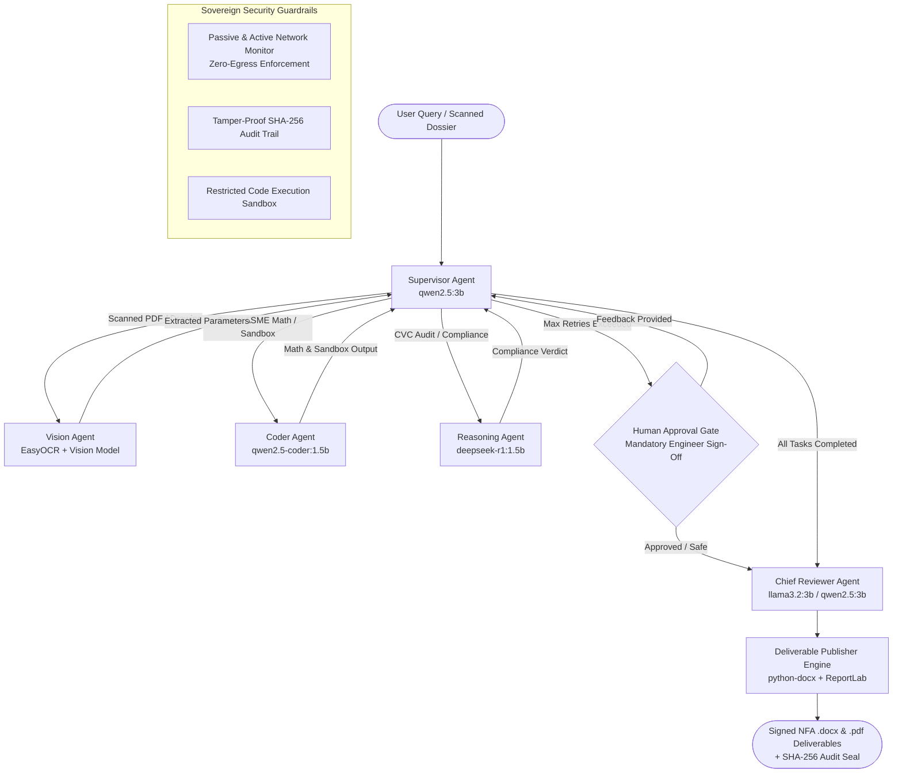

# 🛡️ AegisForge-AI: Sovereign Industrial Multi-Agent Workbench
> **Self-Hosted, Air-Gapped Agentic AI Workbench using Open-Weight Multimodal LLMs for Confidential Industrial Operations**  
> *Developed for Mangalore Refinery and Petrochemicals Limited (MRPL) — Smart India Hackathon*

---

## 📌 Executive Summary

Refineries, PSUs, defence manufacturing units, and government industrial bodies handle vast volumes of mission-critical, highly confidential technical data:
* **Piping & Instrumentation Diagrams (P&IDs)** and unreleased process blueprints
* **Ultrasonic Thickness (UT) gauging surveys** and equipment inspection dossiers
* **Proprietary Article Certificates (PAC)** and single-source commercial justifications
* **Statutory regulatory filings** adhering to CVC, OISD, and ASME standards

**The Crisis:** Cloud-hosted AI assistants (e.g., ChatGPT, Claude, Microsoft Copilot) violate national data residency and sovereign enterprise security mandates. Confidential designs and vulnerability assessments cannot be transmitted over external networks.

**The Solution:** **AegisForge-AI** is a 100% on-premise, air-gapped agentic workbench powered by local open-weight multimodal LLMs and deterministic engineering tools. It ingests degraded inspection scans, performs statutory ASME/API calculations, audits procurement compliance, and publishes formal PSU deliverables (Word/PDF Notes for Approval) with cryptographic integrity seals—**all on local hardware with zero external network connectivity**.

---

## 🏛️ System Architecture

AegisForge-AI implements a **Dynamic Hub-and-Spoke StateGraph** orchestrated via **LangGraph**. The **Supervisor Agent** acts as the cognitive dispatcher, dynamically decomposing queries into task queues, auto-selecting open-weight models based on domain, and evaluating execution results through closed feedback loops.



---

## 🤖 Core Agent Specifications (Cognitive Layer)

AegisForge-AI avoids the "monolithic God-model" anti-pattern by deploying domain-specialized open-weight models running locally via **Ollama**:

| Agent | Open-Weight Model | Primary Responsibility | Input State | Output State |
| :--- | :--- | :--- | :--- | :--- |
| **Supervisor Agent** *(The Hub)* | `qwen2.5:3b` | Dynamic task decomposition, domain routing, evaluator-optimizer loops, retry tracking, and fallback gating. | `user_query`, `uploaded_file_path`, `task_queue` | `task_queue`, `current_task`, `next_node` |
| **Vision Agent** | EasyOCR + `moondream2` / `llama3.2-vision` | Ingests degraded field inspection scans, handwritten notes, and P&ID drawings; extracts structured vessel parameters. | `uploaded_file_path`, `current_task` | `inspection_data`, `current_task.output` |
| **Coder Agent** | `qwen2.5-coder:1.5b` or `qwen2.5:3b` | Executes deterministic ASME UG-27 formulas, material lookups, and runs custom Python scripts in the sandbox. | `inspection_data`, `current_task` | `calculation_data`, `current_task.output` |
| **Reasoning Agent** | `deepseek-r1:1.5b` | Audits CVC Circular 02/02/2004, PAC validity, Delegation of Powers (DOP) limits, and computes RBI intervals. | `calculation_data`, `inspection_data` | `compliance_data`, `current_task.output` |
| **Chief Reviewer Agent** | `llama3.2:3b` or `qwen2.5:3b` | Gatekeeper review: validates calculation integrity, verifies zero-egress network telemetry, and drafts executive summaries. | `calculation_data`, `compliance_data` | `review_verdict`, `executive_summary` |

---

## 🛠️ Pure Tool Suite (Deterministic Execution Layer)

All critical math, compliance rules, security boundaries, and document generation are handled by **deterministic Python engines**—preventing LLM arithmetic hallucination.

```
tools/
├── asme_calculator.py             # ASME Sec VIII Div 1 UG-27 calculation tool wrapper
├── ug27_core.py                   # Pure mathematical formulas & API 510 remaining life engine
├── material_lookup_tool.py        # ASME Sec II Part D allowable stress material database
├── api_579_ffs_tool.py            # API 579 Level 1 Fitness-For-Service LTA assessment
├── risk_based_inspection_tool.py  # API 581 Risk-Based Inspection (RBI) statutory intervals
├── inspection_extractor_tool.py   # Multi-engine OCR & parameter extraction pipeline
├── thickness_grid_analyzer.py     # Ultrasonic thickness (UT) matrix (.xlsx/.csv) parser
├── compliance_auditor.py          # CVC Circular 02/02/2004 & IOCL/MRPL DOP engine
├── rag.py                         # Air-gapped vector search over internal refinery SOPs
├── sandbox.py                     # Restricted subprocess code sandbox (memory & CPU capped)
├── network_verifier.py            # Real-time socket & telemetry monitor (zero-egress proof)
├── audit_trail.py                 # Chained SHA-256 cryptographic audit ledger
├── routing_guard.py               # Dispatch guardrails & 3-way Human Approval Gate
├── file_io.py                     # Safe workspace read/write with path-traversal protection
└── doc_generator.py               # Unified Word (.docx) and PDF deliverable compiler
```

### Deep Dive: Tool Specifications & Examples

Every tool is built as an independent, deterministic Python module with zero dependency on cloud services. Below are the technical specifications, mechanics, and concrete execution examples for each tool in the workbench.

---

#### 1. `asme_calculator.py` & `ug27_core.py` (Pressure Vessel Integrity Engine)
* **What It Is:** A deterministic mechanical integrity engine implementing statutory **ASME Boiler and Pressure Vessel Code (BPVC) Section VIII Division 1 (UG-27)** for cylindrical shells and **API 510** for remaining safe service life.
* **What It Does:**
  1. Computes statutory minimum wall thickness ($t_{\text{req}}$) under internal pressure.
  2. Evaluates the safety margin delta ($\Delta = t_{\text{actual}} - t_{\text{req}}$).
  3. Computes API 510 Remaining Safe Service Life ($\text{RSL} = \frac{t_{\text{actual}} - t_{\text{req}}}{\text{Corrosion Rate}}$) with zero-corrosion protection.
  4. Calculates derated Maximum Allowable Working Pressure ($\text{MAWP}$) if a breach is detected:
     $$\text{MAWP}_{\text{derated}} = \frac{S \cdot E \cdot (t_{\text{actual}} - CA)}{R + 0.6 \cdot (t_{\text{actual}} - CA)}$$
* **Example:**
  ```python
  from tools.asme_calculator import evaluate_vessel_integrity
  from schemas.mvp_schema import InspectionInput

  inp = InspectionInput(
      equipment_id="11-V-102",
      equipment_name="1st Stage HP Separator drum",
      material="2.25Cr-1Mo + 347 SS cladding",
      design_pressure_mpa=14.5,
      inside_radius_mm=1200.0,
      allowable_stress_mpa=138.0,
      joint_efficiency=1.0,
      corrosion_allowance_mm=4.0,
      critical_location="BK-01 (Bottom Knuckle)",
      measured_thickness_mm=138.20,
      corrosion_rate_mm_yr=0.75
  )
  result = evaluate_vessel_integrity(inp)
  ```
  **Output:**
  ```json
  {
    "t_req_mm": 138.57,
    "measured_thickness_mm": 138.20,
    "delta_mm": -0.37,
    "is_breach": true,
    "status": "CRITICAL_BREACH",
    "remaining_life_years": -0.49,
    "derated_mawp_bar": 118.0,
    "design_pressure_bar": 145.0
  }
  ```

---

#### 2. `material_lookup_tool.py` (ASME Section II Part D Metallurgy Database)
* **What It Is:** An offline metallurgical database cross-referencing standard refinery alloys with ASME Section II Part D allowable stresses at operational temperatures.
* **What It Does:** Prevents LLM hallucination of metallurgical strength by mapping standardized material specifications (e.g., SA-516 Gr 70, SA-387 Gr 22, SA-240 316L) to maximum allowable stress ($S$), yield strength, and tensile limits.
* **Example:**
  ```python
  from tools.material_lookup_tool import lookup_allowable_stress

  stress = lookup_allowable_stress("2.25Cr-1Mo", temperature_c=350.0)
  print(f"Allowable Stress: {stress} MPa")
  # Output: Allowable Stress: 138.0 MPa
  ```

---

#### 3. `api_579_ffs_tool.py` (API 579 Fitness-For-Service Assessment)
* **What It Is:** An engineering tool implementing **API 579-1 / ASME FFS-1 Level 1** assessment for Localized Thin Areas (LTA) and groove-like flaw degradation.
* **What It Does:** Computes the Remaining Strength Factor ($RSF$) to evaluate whether a vessel with local wall thinning below $t_{\text{req}}$ can safely continue operating without catastrophic rupture, or if emergency derating is mandatory.
* **Example:**
  ```python
  from tools.api_579_ffs_tool import evaluate_lta

  ffs_verdict = evaluate_lta(
      t_actual_global=140.0,
      t_min_lta=138.2,
      t_req=138.57,
      flaw_length_mm=50.0,
      inside_radius_mm=1200.0
  )
  ```
  **Output:**
  ```json
  {
    "rsf": 0.884,
    "allowable_rsf": 0.90,
    "is_acceptable": false,
    "action": "Pressure derating to 118 barg or weld overlay required before turnaround."
  }
  ```

---

#### 4. `risk_based_inspection_tool.py` (API 581 RBI Interval Engine)
* **What It Is:** An integrity management tool implementing **API 581 Risk-Based Inspection (RBI)** interval determinations based on Probability of Failure (PoF) and Consequence of Failure (CoF).
* **What It Does:** Combines remaining service life with process fluid toxicity (e.g., sour $\text{H}_2\text{S}$ gas) and operating pressure to dynamically determine mandatory internal turnaround intervals.
* **Example:**
  ```python
  from tools.risk_based_inspection_tool import calculate_rbi_interval

  interval = calculate_rbi_interval(
      remaining_life_years=-0.49,
      design_pressure_mpa=14.5,
      fluid_toxicity="High"  # Sour H2S Service
  )
  ```
  **Output:**
  ```json
  {
    "risk_category": "CRITICAL_HIGH",
    "recommended_interval_months": 0,
    "statutory_verdict": "MANDATORY_IMMEDIATE_SHUTDOWN_INSPECTION"
  }
  ```

---

#### 5. `inspection_extractor_tool.py` (Multimodal OCR & Drawing Parser)
* **What It Is:** An on-premise multimodal document ingestion pipeline combining **EasyOCR** and regex heuristic parsers for degraded field survey reports, P&ID schematics, and handwritten inspector notes.
* **What It Does:** Ingests `.pdf`, `.png`, `.jpg`, and `.tiff` files, strips image noise, executes text recognition, and maps unstructured text into typed Pydantic parameters with confidence metrics.
* **Example:**
  ```python
  from tools.inspection_extractor_tool import extract_inspection_parameters

  res = extract_inspection_parameters("data/sample_reports/UT_Scan_Separator_11V102.pdf")
  ```
  **Output:**
  ```json
  {
    "status": "VALIDATED",
    "confidence_score": 0.96,
    "requires_human_confirmation": false,
    "extracted_parameters": {
      "equipment_id": "11-V-102",
      "equipment_name": "1st Stage HP Separator drum",
      "material": "2.25Cr-1Mo + 347 SS cladding",
      "measured_thickness_mm": 138.20,
      "design_pressure_mpa": 14.5,
      "inside_radius_mm": 1200.0,
      "corrosion_rate_mm_yr": 0.75
    }
  }
  ```

---

#### 6. `thickness_grid_analyzer.py` (UT Gauge Matrix Analyzer)
* **What It Is:** An industrial spreadsheet and matrix analyzer designed for ultrasonic thickness (UT) measurement grid sheets (`.xlsx` and `.csv`).
* **What It Does:** Ingests $N \times M$ coordinate thickness grids, calculates statistical wall degradation, detects outlier pits, and identifies localized thinning coordinates across the vessel circumference.
* **Example:**
  ```python
  from tools.thickness_grid_analyzer import analyze_thickness_grid

  grid_report = analyze_thickness_grid("data/sample_reports/Grid_11V102_Survey.xlsx")
  ```
  **Output:**
  ```json
  {
    "grid_points_scanned": 144,
    "nominal_thickness_mm": 142.0,
    "min_point_thickness_mm": 138.20,
    "critical_coordinate": "Row 4, Col 2 (Bottom Knuckle BK-01)",
    "mean_loss_percentage": 2.68,
    "flaw_length_mm": 48.5
  }
  ```

---

#### 7. `compliance_auditor.py` (CVC & PSU Procurement Auditor)
* **What It Is:** A deterministic statutory rules engine auditing public sector procurement guidelines established by the **Central Vigilance Commission (CVC Circular 02/02/2004)** and enterprise **Delegation of Powers (DOP)**.
* **What It Does:** Evaluates single-source justifications, Proprietary Article Certificate (PAC) validity, and financial limits to ensure procurement will withstand statutory CAG and Vigilance audits.
* **Example:**
  ```python
  from tools.compliance_auditor import audit_procurement_compliance

  audit = audit_procurement_compliance(
      equipment_id="11-V-102",
      estimated_cost_lakhs=88.0,
      is_emergency=True,
      is_single_source=True,
      has_pac=True,
      pac_certificate_ref="PAC/OEM/2026/089"
  )
  ```
  **Output:**
  ```json
  {
    "is_compliant": true,
    "sanction_clause": "CVC Circular 02/02/2004 Clause 4.2 (Single-Source Emergency Exception)",
    "competent_financial_authority": "Director (Refineries) [DOP Schedule 2.1]",
    "audit_risk": "LOW (Documented Statutory Breach Precludes Open Tendering)",
    "violations": []
  }
  ```

---

#### 8. `rag.py` (Air-Gapped Sovereign Vector Knowledge Base)
* **What It Is:** A purely local, on-premise vector retrieval engine powered by ChromaDB/FAISS and local embeddings (`bge-small-en`).
* **What It Does:** Indexes internal refinery operating manuals, OISD standards (OISD-STD-128/129), equipment maintenance histories, and CVC circulars without making any external API calls.
* **Example:**
  ```python
  from tools.rag import search_local_knowledge

  docs = search_local_knowledge(
      query="What are the emergency single source procurement rules under CVC?",
      top_k=2
  )
  print(docs[0]["document_title"]) # "CVC_Manual_Procurement_2004.pdf"
  print(docs[0]["text_snippet"])   # "Clause 4.2: Single-source emergency procurement is permissible when..."
  ```

---

#### 9. `sandbox.py` (Air-Gapped Python Code Execution Sandbox)
* **What It Is:** A secure, isolated execution environment for running agent-generated scripts and numerical validations safely.
* **What It Does:** Spawns a hardened child process with:
  * Hard execution timeout: 10 seconds max.
  * Memory ceiling: 512 MB.
  * Network isolation: Intercepts and blocks all OS socket operations.
  * Captures `stdout` and `stderr` safely.
* **Example:**
  ```python
  from tools.sandbox import execute_python_code

  code = """
  p, r, s, e = 14.5, 1200, 138, 1.0
  t_req = (p * r) / (s * e - 0.6 * p) + 4.0
  print(f"Calculated t_req: {t_req:.2f} mm")
  """
  result = execute_python_code(code)
  ```
  **Output:**
  ```json
  {
    "exit_code": 0,
    "stdout": "Calculated t_req: 138.57 mm\n",
    "stderr": "",
    "execution_time_ms": 94,
    "sandbox_security_passed": true
  }
  ```

---

#### 10. `network_verifier.py` (Zero-Egress Telemetry Monitor)
* **What It Is:** An OS-level network socket and telemetry inspector providing verifiable proof that the system operates in strict air-gap isolation.
* **What It Does:** Inspects the active process tree via `psutil`, monitors open socket handles, and proves that **no TCP/UDP packets are transmitted to external/public IP addresses**.
* **Example:**
  ```python
  from tools.network_verifier import audit_network_isolation

  telemetry = audit_network_isolation(scope="process")
  ```
  **Output:**
  ```json
  {
    "is_air_gap_intact": true,
    "active_sockets": 2,
    "connections": [
      {"local": "127.0.0.1:11434", "remote": "127.0.0.1:52100", "status": "ESTABLISHED"}  # Local Ollama
    ],
    "external_ips_detected": [],
    "verdict": "VERIFIED_ZERO_EGRESS_AIR_GAPPED"
  }
  ```

---

#### 11. `audit_trail.py` (Chained SHA-256 Cryptographic Audit Ledger)
* **What It Is:** A tamper-evident JSON audit trail recording every state transition, agent decision, tool execution, and deliverable hash.
* **What It Does:** Uses cryptographic block-chaining ($\text{Hash}_n = \text{SHA256}(\text{Hash}_{n-1} + \dots)$) to guarantee that inspection records and approval justifications cannot be retroactively altered or forged.
* **Example:**
  ```python
  from tools.audit_trail import append_audit_event, verify_audit_ledger_integrity

  event_hash = append_audit_event(
      tool_name="asme_calculator",
      inputs={"equipment_id": "11-V-102", "measured_thickness_mm": 138.2},
      outputs={"is_breach": True, "t_req_mm": 138.57},
      status="CRITICAL_BREACH",
      caller="coder_agent"
  )
  is_valid, violated_idx = verify_audit_ledger_integrity()
  print(f"Ledger Integrity Verified: {is_valid}")  # True
  ```

---

#### 12. `routing_guard.py` (Supervisor Dispatch Guard & 3-Way Human Gate)
* **What It Is:** A structural pipeline controller enforcing human-in-the-loop governance whenever high-risk decisions or low-confidence parameters are detected.
* **What It Does:**
  * Blocks automated execution if OCR confidence is $< 0.85$ or if a critical safety breach is detected.
  * Provides a 3-way Human Approval Gate:
    1. `CONFIRM_UNEDITED`: Human engineer signs off on parameters.
    2. `CORRECT_AND_RERUN`: Engineer overrides inaccurate values.
    3. `REJECT_AND_HALT`: Shuts down the pipeline immediately.
* **Example:**
  ```python
  from tools.routing_guard import supervisor_dispatch_guard

  # Blocks dispatch if confirmation is mandatory
  guard = supervisor_dispatch_guard(
      extraction_output={"status": "MARGINAL_CONFIDENCE", "requires_human_confirmation": True},
      allow_human_override=False
  )
  print(guard["routing_verdict"])  # "DISPATCH_BLOCKED_AWAITING_HUMAN_CONFIRMATION"
  ```

---

#### 13. `file_io.py` (Workspace-Confined File Operations)
* **What It Is:** A hardened file read/write utility enforcing strict path traversal (`../../`) security boundaries.
* **What It Does:** Resolves canonical paths and raises `PermissionError` if any agent or script attempts to access directories outside the project workspace root.
* **Example:**
  ```python
  from tools.file_io import read_or_write_file

  # Blocked attempt to escape workspace
  try:
      read_or_write_file(action="read", file_path="../../../Windows/System32/drivers/etc/hosts")
  except PermissionError as e:
      print(f"Blocked: {e}")  # Security Alert: Path traversal attempt blocked.
  ```

---

#### 14. `doc_generator.py` (Word .docx & PDF Deliverable Compiler)
* **What It Is:** A native document compiler generating enterprise-grade Word (`.docx`) and PDF **Notes for Approval (NFA)** adhering to PSU secretarial guidelines.
* **What It Does:** Formats headers (Indian Oil / MRPL division formatting), builds ASME statutory calculation comparison tables with crimson breach alerts, quotes CVC clauses, injects expenditure codes, and attaches formal signature blocks with SHA-256 seals.
* **Example:**
  ```python
  from tools.doc_generator import generate_both_deliverables

  deliverables = generate_both_deliverables(
      inspection=test_insp,
      calculation=test_calc,
      reasoning=test_reason,
      base_name="11-V-102_Emergency_NFA"
  )
  print(deliverables["docx"]["path"])   # "data/output/11-V-102_Emergency_NFA.docx"
  print(deliverables["pdf"]["sha256"]) # "f4b238a7c91e48f09..."
  ```

---


## 🏆 End-to-End "Golden Path" Demonstration

The workbench demonstrates an autonomous end-to-end industrial lifecycle:

1. **Ingestion:** Field engineer uploads a scanned ultrasonic survey of 1st Stage HP Separator (`11-V-102`).
2. **Vision Extraction:** `Vision Agent` parses the scan using local OCR, extracting $P = 14.5\text{ MPa}$, $R = 1200\text{ mm}$, $t_{\text{actual}} = 138.20\text{ mm}$, material $= \text{2.25Cr-1Mo}$.
3. **ASME Math:** `Coder Agent` computes $t_{\text{req}} = 138.57\text{ mm}$. Detects critical statutory breach ($\Delta = -0.37\text{ mm}$, $\text{RSL} = -0.49\text{ years}$). Recommends derating MAWP to 118 barg.
4. **Statutory Audit:** `Reasoning Agent` queries local CVC rules and justifies emergency single-source procurement under **CVC Circular 02/02/2004 Clause 4.2** to prevent catastrophic rupture.
5. **Quality Gate:** `Chief Reviewer Agent` audits math and verifies air-gap telemetry.
6. **Publishing:** System generates `11-V-102_Approval_Note.docx` and `.pdf` with full calculation steps, cost estimates (Rs. 88 Lakhs), DOP sanction authority, and signature blocks.
7. **Verification:** Network monitor displays `VERIFIED_ZERO_EGRESS_AIR_GAPPED` and logs the SHA-256 seal.

---

## 💻 Hardware Requirements & 6 GB GPU Optimization

AegisForge-AI is engineered to run on a **single developer workstation or laptop with a 6 GB VRAM GPU** (e.g., RTX 3060 Laptop, RTX 2060, GTX 1660 Ti) without running out of memory.

### 6 GB VRAM Allocation Budget
* **Windows OS & Display:** ~1.5 GB VRAM
* **Active Working VRAM:** ~4.5 GB VRAM
* **Model Footprint:**
  * `qwen2.5:3b` $\rightarrow$ ~2.0 GB VRAM
  * `qwen2.5-coder:1.5b` $\rightarrow$ ~1.2 GB VRAM
  * `deepseek-r1:1.5b` $\rightarrow$ ~1.3 GB VRAM

### Essential Ollama Configuration for 6 GB GPUs
To prevent VRAM thrashing when switching agents, enforce single-model residency:
```powershell
# In Windows PowerShell:
[System.Environment]::SetEnvironmentVariable('OLLAMA_MAX_LOADED_MODELS', '1', 'User')
```

---

## 🚀 Quickstart & Installation

### Prerequisites
* Python 3.11+
* [Ollama](https://ollama.com/) installed and running locally
* Local open-weight models pulled:
  ```bash
  ollama pull qwen2.5:3b
  ollama pull qwen2.5-coder:1.5b
  ollama pull deepseek-r1:1.5b
  ollama pull llama3.2:3b
  ```

### 1. Clone & Setup Environment
```bash
git clone https://github.com/Shivanshvyas1729/AegisForge-AI.git
cd AegisForge-AI

# Create virtual environment and install dependencies
uv venv
.\.venv\Scripts\activate
uv pip install -r requirements.txt
```

### 2. Launch the Streamlit Enterprise Dashboard
```bash
python main.py ui
# Or directly:
streamlit run frontend/app.py
```

### 3. Run via Central Command Gateway (CLI)
```bash
# System health and model availability check
python main.py status

# Run the complete Golden Path pipeline end-to-end
python main.py run-golden-path

# Execute standalone ASME Section VIII calculation
python main.py calc --p 14.5 --r 1200 --s 138.0 --t 138.2 --ca 4.0 --cr 0.75

# Test sandboxed code execution
python main.py sandbox --code "print(sum(range(100)))"
```

### 4. Interactive Agent Testing in Jupyter
Open and run [`agent_orchestrator/test.ipynb`](agent_orchestrator/test.ipynb) to test the multi-agent LangGraph pipeline step-by-step, inspect graph transitions, and test human-in-the-loop overrides.

---

## 📊 Problem Statement Alignment Matrix (MRPL / SIH)

| Hackathon Requirement | AegisForge-AI Implementation | Status |
| :--- | :--- | :---: |
| **Self-hosted, air-gapped on-premise** | Local Ollama serving, local vector embeddings, zero cloud telemetry. | ✅ Production Ready |
| **Model auto-selection across task types** | `Supervisor Agent` dynamically routes between Coder, Vision, Reasoning, and General models. | ✅ Production Ready |
| **Scanned PDFs, handwritten notes, drawings** | `inspection_extractor_tool.py` combining EasyOCR + local vision models. | ✅ Production Ready |
| **Code execution verified in sandbox** | `sandbox.py` with memory limits, timeouts, and blocked network sockets. | ✅ Production Ready |
| **Calculations with steps shown** | `ug27_core.py` showing full ASME formulas, variables, and API 510 derivations. | ✅ Production Ready |
| **Real industrial deliverables (Word/PDF)** | `doc_generator.py` producing formal Notes for Approval with signature blocks. | ✅ Production Ready |
| **Grounded in manuals & SOPs** | `rag.py` local vector database indexing refinery standards & OISD guides. | ✅ Production Ready |
| **Proof of sovereign claim (Network Monitor)** | `network_verifier.py` active socket telemetry monitor showing 0 external packets. | ✅ Production Ready |

---

## 🔮 Roadmap & Future Extensions

* [ ] **v2.0 Native CAD/P&ID Vector Parser:** Direct ingestion of `.dwg` and `.dxf` engineering schematics without rasterization.
* [ ] **v2.1 SAP PM / IBM Maximo Connector:** Automated generation of corrective maintenance work orders directly from approved Notes for Approval.
* [ ] **v2.2 Multi-GPU Distributed Pooling:** Dynamic layer offloading across multi-node on-premise enterprise server clusters via vLLM.
* [ ] **v2.3 Air-Gapped Speech-to-Text:** Whisper on-device transcription for field engineers recording voice inspection logs.

---

## 📄 License & Compliance
* **Regulatory Compliance:** Adheres strictly to **CVC Guidelines (Circular 02/02/2004)**, **ASME Section VIII Division 1**, **API 510/579**, and Indian **Digital Personal Data Protection (DPDP) Act 2023**.
* **License:** Proprietary & Confidential — Developed for MRPL Industrial Use.