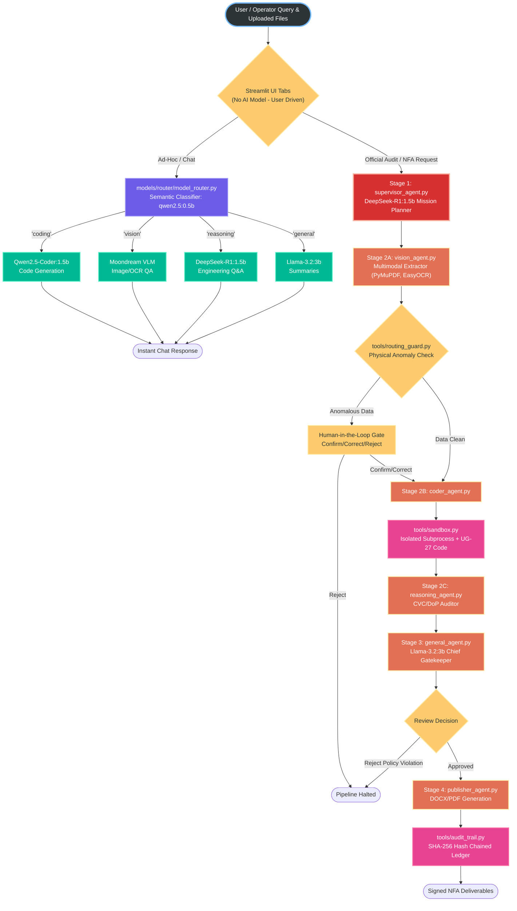

# AegisForge-AI: Sovereign Air-Gapped Multi-Agent AI Workbench for PSUs & Critical Infrastructure

> **Self-hosted, air-gapped agentic AI workbench running entirely on on-premises infrastructure with zero data leakage, deterministic engineering math, and statutory CVC/DoP compliance.**

[](https://www.python.org/)
[](https://github.com/langchain-ai/langgraph)
[](#)
[](#)
[](https://ollama.com/)
[](#)
[](#)
[](LICENSE)

---

## Executive Summary

Public Sector Undertakings (PSUs) such as **IOCL, ONGC, BPCL, HPCL, GAIL, NTPC**, defense manufacturing units (**DRDO, HAL, BEL**), and statutory safety directorates (**PESO, OISD, CVC**) handle confidential operational data, ultrasonic thickness survey grids, and high-value procurement notes. None of this sensitive IP can ever be transmitted to public cloud LLMs due to national data sovereignty laws, corporate air-gap mandates, and life-safety liabilities.

**AegisForge-AI** provides an industrial-grade, fully sovereign, multi-agent AI workbench that runs **100% on-premises** with **zero external network calls**:
1. **Never Hallucinates Engineering Math**: Engineering arithmetic (ASME Section VIII Div 1 UG-27 minimum wall thickness, API 579 Fitness-For-Service) is strictly calculated by deterministic Python engines. LLMs **never** calculate numbers.
2. **Enforces Causal Regulatory Governance**: Statutory CVC Circular 02/02/2004 emergency single-source procurement justifications are causally locked to verified structural breach calculations.
3. **Dynamic Hub-and-Spoke Architecture**: A powerful AI Supervisor actively plans tasks, routes them to specialized local models, and evaluates their deterministic outputs.
4. **Mandates a Human Approval Gate**: If an agent fails a task, the Supervisor safely halts the pipeline to accept human intervention.
5. **Compiles Signed Executive Deliverables**: Emits native, cryptographically sealed Microsoft Word (`.docx`) and Adobe PDF (`.pdf`) Notes for Approval.

---

## Global System Architecture Map



---

## Core Features — What's Built & How It Works

### 1. ⚙️ The "Dual-Engine" Philosophy (Trust & Reasoning)
Industrial users often distrust AI for critical engineering math. AegisForge-AI addresses this with a Dual-Engine architecture, explicitly separated in the Streamlit UI:
- **Engine 1: 🧮 ASME Calculator (Zero-AI Zone):** A pure, deterministic Python math engine that evaluates statutory ASME UG-27 and API 510 equations. No LLMs are used here, ensuring 100% reproducible and trustworthy math.
- **Engine 2: 💬 AI Workbench (Agentic Copilot):** A contextual reasoning engine powered by specialized local SLMs (DeepSeek, Qwen). It uses the ASME Calculator as a backend tool to get the hard numbers, and then generates the statutory compliance reasoning (e.g., CVC Circular analysis).

### 2. 🧠 Multi-Agent Orchestration & Agentic Workflow (LangGraph StateGraph)
AegisForge-AI coordinates a sovereign **4-stage multi-agent pipeline** built on [LangGraph](https://github.com/langchain-ai/langgraph). Specialized local LLMs, deterministic calculation engines, statutory compliance auditors, and human operators collaborate through a strictly typed state machine (`MultiAgentSystemState`).

| Guarantee | Enforcement Mechanism | Failure / Violation Behavior |
| :--- | :--- | :--- |
| **Zero Math Hallucination** | Small local models are strictly restricted to parsing and synthesis. All calculations pass through verified deterministic Python engines. | LLMs are not permitted to compute or alter numerical values. |
| **Causal Compliance** | `reasoning_agent` consumes mathematically verified `calculation_data`. | Emergency single-source is rejected with `NON_COMPLIANT_CVC_VIOLATION` if $\Delta \ge 0.0\text{ mm}$. |
| **Fraudulent PAC Detection** | PAC certificates cited in procurement claims are checked against verified local registries. | Unverified or missing PACs trigger `NON_COMPLIANT_CVC_VIOLATION` and flag the document. |
| **Human-in-the-Loop Fallback** | The Supervisor evaluates agent outputs. If an LLM hallucination or crash occurs, it retries 3 times before routing to `GATE_WAITING_HUMAN`. | Infinite loops and silent failures are mathematically prevented. Pipeline halts securely. |
| **Cryptographic Audit Ledger** | Every tool execution and human override is hash-chained via $\text{SHA256}(\text{prev\_hash} + \text{canonical\_payload})$. | Any tampering, deletion, or modification is flagged with exact entry index identification. |

### 3. 🔢 Deterministic Engineering Math (ASME Section VIII Div 1 UG-27)
Wall thickness calculations follow the **ASME Boiler and Pressure Vessel Code (BPVC)** Section VIII Div 1 (UG-27) standard:

$$t_{req} = \frac{P \times R}{S \times E - 0.6 \times P} + CA$$

**API 579-1/ASME FFS-1 Fitness-For-Service (Part 4 LTA):**
If a breach occurs ($\Delta < 0.0$), the system automatically evaluates the Local Thin Area (LTA) length against the critical length $L_c$ to determine if the vessel requires an immediate operational shutdown or if it can survive via de-rating.

$$L_c = 1.123 \times \sqrt{D \times t_{actual}}$$

### 4. ⚖️ Statutory CVC & DoP Procurement Compliance Engine
The `tools/compliance_auditor.py` enforces **Central Vigilance Commission (CVC)** guidelines and **IOCL Delegation of Powers (DoP)** statutes for emergency procurement. It validates that emergency single-source procurement is only permitted when a genuine structural breach exists ($\Delta < 0.0$ mm). Any hallucinated, expired, or unverifiable PAC triggers `EXPIRED_PAC_VIOLATION`, halting the pipeline.

### 5. 🛡️ 3-Way Human Approval Gate with Recovery
When the Inspection Worker detects anomalous or unphysical readings, the pipeline halts at a **Human Approval Gate** with three options:
- `CONFIRM_UNEDITED`: Accept original values
- `CORRECT_AND_RERUN`: Inject corrected values (protected from overwrite)
- `REJECT_AND_HALT`: Stop pipeline completely

### 6. 🔐 Air-Gapped Python Code Sandbox
The `tools/sandbox.py` module provides a hardened, air-gapped computational execution environment designed to run Python math and data-transformation scripts without endangering the host operating system. It enforces a strict AST Allowlist, Subprocess Isolation, and Active Watchdog Limits (Memory/Timeout).

### 7. 🌐 Passive Air-Gap Network Telemetry Auditor
The `tools/network_verifier.py` proves the sovereign air-gap claim through **passive inspection of active network sockets** — without transmitting any outbound packets.

---

## Installation Guide

### Prerequisites
| Requirement | Minimum | Recommended |
|---|---|---|
| **Python** | 3.11 | 3.12 |
| **RAM** | 8 GB | 16 GB |
| **Disk Space** | 15 GB (for models) | 25 GB |
| **OS** | Windows 10/11, Ubuntu 22.04+ | Windows 11 |

### Step 1: Clone the Repository
```bash
git clone https://github.com/Shivanshvyas1729/AegisForge-AI.git
cd AegisForge-AI
```

### Step 2: Create a Virtual Environment
```bash
uv venv .venv
# Windows PowerShell:
.venv\Scripts\activate
```

### Step 3: Install Project Dependencies
```bash
pip install -r requirements.txt
```

### Step 4: Install & Configure Ollama
1. Download and install [Ollama](https://ollama.com/download) for your OS.
2. Pull the required models:
```bash
ollama pull deepseek-r1:1.5b
ollama pull qwen2.5-coder:1.5b
ollama pull llama3.2:3b
ollama pull moondream
```

### Step 5: Run Automated Verification Suites
```bash
# Verify all sovereign tools & security hardening
python tests/test_sovereign_toolset.py

# Verify the full 4-stage multi-agent orchestration pipeline
python tests/test_multi_agent_system.py
```

### Step 6: Launch the Application
```bash
# Launch the Streamlit Web Dashboard
python main.py ui

# Run the central CLI operating menu
python main.py
```

---

## Project Structure

```
AegisForge-AI/
├── main.py                            # Central CLI Operating Gateway (7 commands)
├── frontend/
│   └── app.py                         # Streamlit Web Dashboard (3 tabs)
│
├── agent_orchestrator/                # LangGraph Hub-and-Spoke Multi-Agent System
│   ├── base_agent.py                  # Ollama interface with timeout & fail-fast
│   ├── multi_agent_graph.py           # Compiled StateGraph with conditional edges
│   ├── supervisor_agent.py            # Mission planner decomposing goals and evaluating agents
│   ├── vision_agent.py                # Visual extraction utilizing EasyOCR multimodal engine
│   ├── coder_agent.py                 # Math & Engineering verification (ASME / API 579)
│   ├── reasoning_agent.py             # Statutory Compliance & Risk-Based Inspection (RBI)
│   ├── general_agent.py               # Chief Technical Reviewer gatekeeper auditing all outputs
│   ├── publisher_agent.py             # Emits signed DOCX/PDF deliverables and manifest
│   └── state.py                       # MultiAgentSystemState TypedDict
│
├── tools/                             # 15 Sovereign Industrial Tools
│   ├── api_579_ffs_tool.py            # API 579 Fitness-For-Service LTA assessment
│   ├── material_lookup_tool.py        # ASME Section II Part D stress database
│   ├── risk_based_inspection_tool.py  # API 581 RBI (PoF / CoF) mapping
│   ├── ug27_core.py                   # Pure ASME UG-27 math engine
│   ├── asme_calculator.py             # ASME calculation facade
│   ├── thickness_grid_analyzer.py     # Multi-point UT grid analyzer
│   ├── compliance_auditor.py          # CVC & DoP statutory auditor
│   ├── routing_guard.py               # 3-Way Human Gate state machine
│   ├── audit_trail.py                 # SHA-256 hash-chained audit ledger
│   ├── network_verifier.py            # Passive air-gap telemetry probe
│   ├── inspection_extractor_tool.py   # Inspection parameter parser
│   ├── sandbox.py                     # AST-allowlisted code sandbox
│   ├── rag.py                         # Sovereign RAG (Qdrant + keyword)
│   ├── file_io.py                     # Path-traversal defended file I/O
│   └── doc_generator.py               # Unified document compiler
│
├── tests/                             # Automated Verification Suites
│   ├── test_sovereign_toolset.py      # Tool unit tests
│   └── test_multi_agent_system.py     # End-to-End Dynamic Orchestration Tests
```

---

## Target Industry Sectors & Regulatory Compliance

- **Oil & Gas Refineries**: Indian Oil Corporation Ltd (IOCL), ONGC, BPCL, HPCL, GAIL
- **Power & Heavy Engineering**: NTPC, BHEL, Power Grid Corporation of India
- **Defence & Strategic Infrastructure**: DRDO, Bharat Electronics Ltd (BEL), Hindustan Aeronautics Ltd (HAL)
- **Governing Regulatory Standards**:
  - **ASME BPVC Section VIII Div 1 (UG-27)**: Rules for Construction of Pressure Vessels.
  - **API 510**: Pressure Vessel Inspection Code: In-service Inspection, Rating, Repair, and Alteration.
  - **API 579-1/ASME FFS-1**: Fitness-For-Service
  - **API 581**: Risk-Based Inspection
  - **CVC Circular No. 02/02/2004**: Guidelines on Tendering & Single-Source Procurement in PSUs.
  - **IOCL Delegation of Powers (DoP) Clause 4.2**: Emergency Procurement Authorities.

---

## License

This project is licensed under the [MIT License](LICENSE).