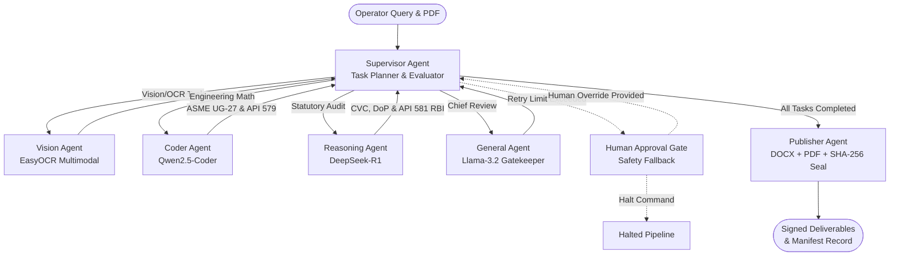

# AegisForge-AI: Sovereign Air-Gapped Multi-Agent AI Workbench for PSUs & Critical Infrastructure

> **Self-hosted, air-gapped agentic AI workbench running entirely on on-premises infrastructure with zero data leakage, deterministic engineering math, and statutory CVC/DoP compliance.**

[](https://www.python.org/)
[](https://github.com/langchain-ai/langgraph)
[](#)
[](#)
[](https://ollama.com/)
[](#)
[](#)
[](LICENSE)

---

## Executive Summary

Public Sector Undertakings (PSUs) such as **IOCL, ONGC, BPCL, HPCL, GAIL, NTPC**, defense manufacturing units (**DRDO, HAL, BEL**), and statutory safety directorates (**PESO, OISD, CVC**) handle confidential operational data, ultrasonic thickness survey grids, and high-value procurement notes. None of this sensitive IP can ever be transmitted to public cloud LLMs due to national data sovereignty laws, corporate air-gap mandates, and life-safety liabilities.

**AegisForge-AI** provides an industrial-grade, fully sovereign, multi-agent AI workbench that:
1. **Never Hallucinates Engineering Math**: Engineering arithmetic (ASME Section VIII Div 1 UG-27 minimum wall thickness, API 579 Fitness-For-Service) is strictly calculated by deterministic Python engines. LLMs **never** calculate numbers.
2. **Enforces Causal Regulatory Governance**: Statutory CVC Circular 02/02/2004 emergency single-source procurement justifications are causally locked to verified structural breach calculations. Structurally safe vessels strictly block emergency single-source procurement.
3. **Dynamic Hub-and-Spoke Architecture**: A powerful AI Supervisor actively plans tasks, routes them to specialized local models (Coder, Reasoning, General), and evaluates their deterministic outputs.
4. **Mandates a Human Approval Gate**: If an agent fails a task (due to an LLM timeout, bad OCR scan, or missing statutory data), the Supervisor safely halts the pipeline (`GATE_WAITING_HUMAN`) to accept human intervention. Every human intervention is cryptographically chained into an unbroken SHA-256 audit ledger.
5. **Compiles Signed Executive Deliverables**: Emits native, cryptographically sealed Microsoft Word (`.docx`) and Adobe PDF (`.pdf`) Notes for Approval, anchored to a tamper-evident `deliverable_manifest.json`.

---

## Dynamic Hub-and-Spoke Multi-Agent Architecture (LangGraph)

AegisForge-AI uses LangGraph to coordinate specialized local models (`deepseek-r1:1.5b`, `llama3.2:3b`, `qwen2.5-coder:1.5b`) around a central AI Supervisor:



### Architectural & Governance Guarantees

| Guarantee | Enforcement Mechanism | Failure / Violation Behavior |
| :--- | :--- | :--- |
| **Zero Math Hallucination** | Small local models are strictly restricted to parsing and synthesis. All calculations pass through verified deterministic Python engines. | LLMs are not permitted to compute or alter numerical values. |
| **Causal Compliance** | `reasoning_agent` consumes mathematically verified `calculation_data`. | Emergency single-source is rejected with `NON_COMPLIANT_CVC_VIOLATION` if $\Delta \ge 0.0\text{ mm}$. |
| **Fraudulent PAC Detection** | PAC certificates cited in procurement claims are checked against verified local registries. | Unverified or missing PACs trigger `NON_COMPLIANT_CVC_VIOLATION` and flag the document. |
| **Human-in-the-Loop Fallback** | The Supervisor evaluates agent outputs. If an LLM hallucination or crash occurs, it retries 3 times before routing to `GATE_WAITING_HUMAN`. | Infinite loops and silent failures are mathematically prevented. Pipeline halts securely. |
| **Cryptographic Audit Ledger** | Every tool execution and human override is hash-chained via $\text{SHA256}(\text{prev\_hash} + \text{canonical\_payload})$. | Any tampering, deletion, or modification is flagged with exact entry index identification. |

---

## Exhaustive Workspace Catalog

```
c:/Users/rahul/SIH-antigravity-offline/
├── agent_orchestrator/                # LangGraph Hub-and-Spoke Multi-Agent System
│   ├── base_agent.py                  # Ollama caller with timeout & fail-fast outage exception
│   ├── multi_agent_graph.py           # Compiled LangGraph state graph & HitL routing
│   ├── supervisor_agent.py            # Mission planner decomposing goals and evaluating agents
│   ├── vision_agent.py                # Visual extraction utilizing EasyOCR multimodal engine
│   ├── coder_agent.py                 # Math & Engineering verification (ASME / API 579)
│   ├── reasoning_agent.py             # Statutory Compliance & Risk-Based Inspection (RBI)
│   ├── general_agent.py               # Chief Technical Reviewer gatekeeper auditing all outputs
│   ├── publisher_agent.py             # Emits signed DOCX/PDF deliverables and manifest
│   └── state.py                       # MultiAgentSystemState TypedDict data contracts
│
├── tools/                             # 15 Verified Sovereign Industrial Tools
│   ├── api_579_ffs_tool.py            # API 579 Fitness-For-Service Local Thin Area (LTA) assessment
│   ├── material_lookup_tool.py        # ASME Section II Part D stress value database
│   ├── risk_based_inspection_tool.py  # API 581 Risk-Based Inspection (PoF / CoF) mapping
│   ├── asme_calculator.py             # ASME UG-27 calculation facade
│   ├── ug27_core.py                   # Pure deterministic math engine ($t_{req}$, $\Delta$, $P_{MAWP}$)
│   ├── compliance_auditor.py          # Statutory CVC & DoP procurement delegation matrix auditor
│   ├── routing_guard.py               # Human confirmation routing guard state machine
│   ├── audit_trail.py                 # Tamper-evident SHA-256 hash-chained JSONL audit ledger
│   ├── network_verifier.py            # Passive air-gap telemetry probe
│   ├── inspection_extractor_tool.py   # EasyOCR deterministic parameter parser
│   ├── sandbox.py                     # Subprocess-isolated computational sandbox
│   ├── rag.py                         # Sovereign local retrieval augmented generation
│   ├── file_io.py                     # Path-traversal defended workspace read/write
│   └── doc_generator.py               # Unified document compiler and cryptographic hashing
│
├── output_generation/                 # Native Document Compilers
│   ├── docx_generator.py              # Native Microsoft Word (.docx) Note for Approval compiler
│   └── pdf_generator.py               # Native Adobe PDF (.pdf) Note for Approval compiler
│
├── tests/                             # Comprehensive Automated Verification Suites
│   ├── test_sovereign_toolset.py      # Boundary Test Suites for all deterministic tools
│   └── test_multi_agent_system.py     # End-to-End Dynamic Orchestration Integration Tests
│
├── frontend/                          # Web UI Dashboard
│   └── app.py                         # Streamlit application (Workbench, ASME Calculator, Model Hub)
│
└── main.py                            # Central CLI Operating Gateway
```

---

## Deterministic Engineering Math

Wall thickness calculations follow the ASME Boiler and Pressure Vessel Code (BPVC) Section VIII Div 1 (UG-27) standard:

$$t_{req} = \frac{P \times R}{S \times E - 0.6 \times P} + CA$$

**API 579-1/ASME FFS-1 Fitness-For-Service (Part 4 LTA):**
If a breach occurs ($\Delta < 0.0$), the system automatically evaluates the Local Thin Area (LTA) length against the critical length $L_c$ to determine if the vessel requires an immediate operational shutdown or if it can survive via de-rating.

$$L_c = 1.123 \times \sqrt{D \times t_{actual}}$$

---

## Quick Start Guide

### 1. Environment Setup

```bash
# Clone the repository
git clone https://github.com/Shivanshvyas1729/AegisForge-AI.git
cd AegisForge-AI

# Install dependencies
pip install -r requirements.txt
```

### 2. Configure Local Models with Ollama

Ensure [Ollama](https://ollama.com/) is installed and running on `http://127.0.0.1:11434`:

```bash
ollama pull deepseek-r1:1.5b
ollama pull llama3.2:3b
ollama pull qwen2.5-coder:1.5b
```

### 3. Run Automated Verification Suites

```bash
# Verify the full dynamic Hub-and-Spoke orchestration pipeline
python tests/test_multi_agent_system.py
```

### 4. Launch the Application

```bash
# Launch the Streamlit Web Dashboard
python main.py ui

# Run the central CLI operating menu
python main.py
```

---

## Target Industry Sectors & Regulatory Compliance

- **Oil & Gas Refineries**: Indian Oil Corporation Ltd (IOCL), ONGC, BPCL, HPCL, GAIL
- **Power & Heavy Engineering**: NTPC, BHEL, Power Grid Corporation of India
- **Defence & Strategic Infrastructure**: DRDO, Bharat Electronics Ltd (BEL), Hindustan Aeronautics Ltd (HAL)
- **Governing Regulatory Standards**:
  - **ASME BPVC Section VIII Div 1 (UG-27)**: Rules for Construction of Pressure Vessels.
  - **API 510**: Pressure Vessel Inspection Code: In-service Inspection, Rating, Repair, and Alteration.
  - **API 579-1/ASME FFS-1**: Fitness-For-Service
  - **API 581**: Risk-Based Inspection
  - **CVC Circular No. 02/02/2004**: Guidelines on Tendering & Single-Source Procurement in PSUs.
  - **IOCL Delegation of Powers (DoP) Clause 4.2**: Emergency Procurement Authorities.

---

## License

This project is licensed under the [MIT License](LICENSE).