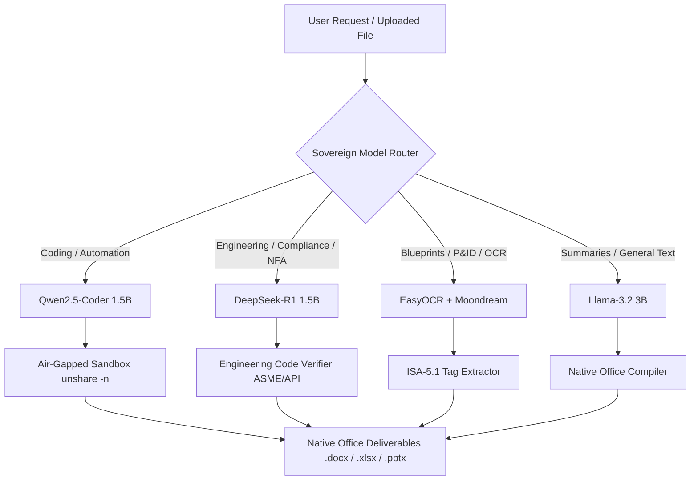

# AegisForge-AI: Sovereign Air-Gapped AI Workbench for PSUs & Critical Infrastructure

> **Self-hosted, air-gapped agentic AI workbench running entirely on on-premises GPU infrastructure with zero data leakage.**

[](https://www.python.org/)
[-green.svg)](https://developer.nvidia.com/cuda-toolkit)
[](https://ollama.com/)
[](#verifiable-air-gap-isolation--security)
[](#sample_datagenerate_sample_documentspy)
[](LICENSE)

---

## Executive Summary

Public Sector Undertakings (PSUs), defence manufacturing units, refineries (IOCL, ONGC, BPCL, HPCL), power utilities (NTPC), and government institutions handle mission-critical, highly confidential knowledge work daily:
- **Executive Approval Notes & Notes for Board (NFA)** adhering to CVC guidelines and Delegation of Powers (DOP)
- **Board presentations & Capex strategies** with sensitive financial allocations
- **Statutory engineering calculations** under ASME Sec VIII, API 510/520/570, and TEMA codes
- **Internal automation scripts, SCADA parsers & Modbus telemetry decoders**
- **Scanned blueprints, P&ID schematics & piping isometric drawings**
- **Statutory inspection & ultrasonic thickness survey reports (NDT)**

None of this sensitive IP can ever be transmitted to public cloud LLMs (such as OpenAI, Anthropic, or proprietary APIs) due to strict national data residency regulations and air-gap network mandates.

**AegisForge-AI** provides an industrial-grade, self-hosted, multi-model AI workbench that dynamically routes requests across specialized open-weight models (reasoning, coding, vision, generalist) and executes agentic tasks with complete on-premises data residency, hardware-level air-gap isolation, and direct compilation of native Microsoft Office deliverables.

---

## Complete Repository Architecture & File Catalog

This section provides an exhaustive catalog of every file and directory in this repository, explaining **what each file contains**, **what it does**, and **its core purpose** within the AegisForge-AI ecosystem.

```
AegisForge-AI/
├── .gitignore
├── commit.bat
├── LICENSE
├── README.md
├── requirements.txt
├── TEAM_TASKS_MVP.md
│
├── agent_orchestrator/
│   └── .gitkeep
│
├── backend/
│   ├── .python-version
│   ├── main.py
│   ├── pyproject.toml
│   ├── README.md
│   ├── requirements.txt
│   └── experiments/
│       └── basic_setup1.ipynb
│
├── config/
│   └── .gitkeep
│
├── data/
│   ├── .gitkeep
│   ├── uploads/
│   │   └── .gitkeep
│   └── vector_storage/
│       └── .gitkeep
│
├── frontend/
│   └── .gitkeep
│
├── ingestion/
│   └── .gitkeep
│
├── knowledge_base/
│   └── .gitkeep
│
├── model_pool/
│   └── .gitkeep
│
├── models/
│   ├── reasoning_models/
│   │   └── test_reasoning.py
│   ├── router/
│   │   └── model_router.py
│   └── vision_models/
│       ├── convert_svg.py
│       ├── test_easyocr.py
│       ├── test_summary.md
│       └── test_vision_vlm.py
│
├── network_isolation/
│   └── .gitkeep
│
├── output_generation/
│   └── .gitkeep
│
├── routing_api/
│   └── .gitkeep
│
├── sample_data/
│   ├── build_samples.bat
│   ├── generate_sample_documents.py
│   ├── README.md
│   ├── 01_approval_notes/
│   │   ├── Defence_Emergency_Procurement_Note.md
│   │   ├── IOCL_Refinery_Pump_Overhaul_Note.docx
│   │   ├── IOCL_Refinery_Pump_Overhaul_Note.json
│   │   └── IOCL_Refinery_Pump_Overhaul_Note.md
│   ├── 02_board_presentations/
│   │   ├── Board_Resolution_Capex_Strategy.json
│   │   ├── Q3_Refinery_Modernization_Deck.md
│   │   └── Q3_Refinery_Modernization_Deck.pptx
│   ├── 03_engineering_calculations/
│   │   ├── ASME_Pressure_Vessel_Thickness_Calc.xlsx
│   │   ├── crude_distillation_relief_valve_api520.csv
│   │   ├── engineering_design_basis_memo.md
│   │   └── pipe_pressure_drop_darcy.py
│   ├── 04_internal_tools_code/
│   │   ├── airgap_safety_sandbox_runner.sh
│   │   ├── asset_maintenance_schema.sql
│   │   ├── scada_modbus_telemetry_parser.py
│   │   └── telemetry_register_mapping.json
│   ├── 05_scanned_drawings_pid/
│   │   ├── cdu_feed_preheat_train_pid.svg
│   │   ├── drawing_review_checklist.md
│   │   ├── pid_legend_and_instrument_tags.json
│   │   └── pump_station_isometric_drawing.svg
│   └── 06_inspection_reports/
│       ├── equipment_corrosion_audit_registry.json
│       ├── field_inspector_raw_ocr_log.txt
│       ├── hydrocracker_reactor_ndt_ultrasonic_report.docx
│       └── hydrocracker_reactor_ndt_ultrasonic_report.md
│
├── schemas/
│   └── .gitkeep
├── tests/
│   └── .gitkeep
└── tools/
    ├── .gitkeep
    └── file_io.py
```

---

### 1. Root-Level Files

| File | What It Contains | What It Does | Purpose |
| :--- | :--- | :--- | :--- |
| **`README.md`** | Complete system documentation, architectural breakdown, file catalog, execution guides, and benchmark descriptions. | Informs developers, operators, and evaluators on how the system works and how to run it. | Serves as the single source of truth for repository architecture, setup instructions, and component purposes. |
| **`TEAM_TASKS_MVP.md`** | 5-person team task division, specific MVP golden path workflow, JSON interface contracts, non-goals, and multi-phase roadmap. | Directs team members on exactly which specific task to build first for the MVP and what to tackle next. | Eliminates team overlap and accelerates MVP delivery for hackathon/demonstration milestones. |
| **`requirements.txt`** | Python dependencies pinned for Python 3.11 in the Conda `SIH` environment (FastAPI, LangChain, LangGraph, Ollama, EasyOCR, python-docx, openpyxl, python-pptx, svglib, reportlab). | Defines all third-party libraries needed to run the API, agents, router, OCR, and document generators. | Ensures a reproducible, unified Python environment across GPU and CPU workstations. |
| **`commit.bat`** | Windows batch script with Git status tracking and staging commands. | Automatically runs `git add -A`, displays `git status --short`, and commits with a descriptive commit message. | Streamlines git workflow for developers working on Windows offline workstations. |
| **`LICENSE`** | Standard MIT open-source license terms. | Grants rights for copying, modifying, and distributing the software. | Defines the open-source licensing parameters of the AegisForge-AI project. |
| **`.gitignore`** | Exclusion patterns for Python caches (`__pycache__`), virtual environments, build artifacts, `.DS_Store`, and temporary OS files. | Prevents compiled bytecode, cache files, and private credentials from being checked into source control. | Keeps the git repository clean, lightweight, and free from binary build residue. |

---

### 2. Model Layer (`models/`)

The `models/` directory houses the dynamic routing engine and test benches for the specialized local models operating within the air-gapped environment.

```
models/
├── reasoning_models/
│   └── test_reasoning.py
├── router/
│   └── model_router.py
└── vision_models/
    ├── convert_svg.py
    ├── test_easyocr.py
    ├── test_summary.md
    └── test_vision_vlm.py
```

#### `models/router/model_router.py`
- **What It Contains**: The `SovereignModelRouter` class, model designation registry (`MODEL_REGISTRY`), and heuristic keyword arrays (`CODING_KEYWORDS`, `REASONING_KEYWORDS`, `VISION_KEYWORDS`).
- **What It Does**: Evaluates input prompts and modalities (text vs image). Automatically classifies the task into `coding`, `reasoning`, `vision`, or `general`, selects the designated local model, and invokes inference locally via the Ollama client.
- **Purpose**: Acts as the central intelligent traffic controller of AegisForge-AI, routing tasks to the most efficient open-weight model to maximize inference accuracy and preserve VRAM on modest GPU hardware (tested on 4GB NVIDIA RTX 3050).

#### `models/reasoning_models/test_reasoning.py`
- **What It Contains**: Standalone evaluation script and prompt harness for the `deepseek-r1:1.5b` reasoning model.
- **What It Does**: Simulates a statutory refinery scenario: passes ultrasonic thickness readings of a hydrocracker reactor nozzle ($138.20\text{ mm}$ measured vs $138.57\text{ mm}$ ASME code minimum) and validates that the model produces step-by-step chain-of-thought derivations and drafting recommendations for a PSU Note for Approval (NFA).
- **Purpose**: Verifies that local reasoning models can handle complex engineering mathematics, regulatory standards, and official PSU administrative justifications.

#### `models/vision_models/convert_svg.py`
- **What It Contains**: Pure Python vector rasterization utility using `svglib` (`svg2rlg`) and `reportlab` (`renderPM`).
- **What It Does**: Reads vector `.svg` blueprints (such as P&ID schematics and piping isometric diagrams) and converts them into `.png` raster images.
- **Purpose**: Bridges the gap between vector CAD exports and computer vision / OCR models that require raster pixel inputs.

#### `models/vision_models/test_easyocr.py`
- **What It Contains**: OCR evaluation script powered by `easyocr` (CRAFT text detection + CRNN text recognition) with automatic CUDA GPU detection and CPU fallback.
- **What It Does**: Processes rasterized P&ID drawings, identifies text bounding boxes, extracts equipment numbers and instrument tags (e.g., `11-P-101`, `PSV-101`), and prints confidence metrics.
- **Purpose**: Provides a lightweight, GPU-independent OCR extraction pipeline capable of digitizing scanned blueprints even on systems without dedicated GPU resources.

#### `models/vision_models/test_vision_vlm.py`
- **What It Contains**: Multimodal Vision-Language Model evaluation harness invoking local Ollama vision models (such as `moondream`).
- **What It Does**: Sends an image file alongside an engineering prompt to identify process units, safety bypass valves, and annotations.
- **Purpose**: Evaluates end-to-end multimodal understanding of complex industrial diagrams where both visual layout and contextual relationships must be synthesized.

#### `models/vision_models/test_summary.md`
- **What It Contains**: Engineering decision record, benchmark results, and hardware compatibility logs for vision models tested on Windows laptops.
- **What It Does**: Explains why models like PaddleOCR, Florence-2, Moondream2, and Qwen2.5-VL failed on constrained environments, and documents EasyOCR's 100% pass rate on sample drawings (45 and 81 text regions detected).
- **Purpose**: Documents architectural decisions for vision pipelines, avoiding regression to incompatible dependencies.

---

### 3. Backend & Serving Layer (`backend/`)

The `backend/` directory encapsulates the server application, API interfaces, and rapid prototyping notebooks.

```
backend/
├── .python-version
├── main.py
├── pyproject.toml
├── README.md
├── requirements.txt
└── experiments/
    └── basic_setup1.ipynb
```

| File | What It Contains | What It Does | Purpose |
| :--- | :--- | :--- | :--- |
| **`backend/main.py`** | Application entry point function (`main()`). | Initializes backend services and runtime verification. | Serves as the bootloader for the backend agent server. |
| **`backend/pyproject.toml`** | Packaging configuration adhering to PEP 621. | Declares project name, version (`0.1.0`), Python requirements (`>=3.12`), and packaging metadata. | Manages packaging and build configuration for backend services. |
| **`backend/requirements.txt`** | Dependency manifest mirroring root requirements for backend containerization. | Lists FastAPI, Uvicorn, LangChain, LangGraph, Ollama, EasyOCR, and OpenXML libraries. | Allows isolated installation of backend service dependencies. |
| **`backend/.python-version`** | Text file declaring target Python version (`3.12`). | Informs version managers (`pyenv`, `mise`, `uv`) which Python runtime to select. | Enforces consistent Python versions across developer environments. |
| **`backend/experiments/basic_setup1.ipynb`** | Interactive Jupyter Notebook with environment checks and test invocations. | Runs interactive tests against local Ollama models and LangChain integrations. | Provides an interactive scratchpad for testing agent nodes and router logic. |

---

### 4. Domain-Curated Industrial Datasets (`sample_data/`)

The `sample_data/` directory contains authentic test fixtures modeled on real-world PSU and critical infrastructure operational workflows across six categories, plus document compilation scripts.

```
sample_data/
├── build_samples.bat
├── generate_sample_documents.py
├── README.md
├── 01_approval_notes/
├── 02_board_presentations/
├── 03_engineering_calculations/
├── 04_internal_tools_code/
├── 05_scanned_drawings_pid/
└── 06_inspection_reports/
```

#### Document Generation Scripts

- **`sample_data/generate_sample_documents.py`**:
  - **What It Contains**: Self-contained Python script utilizing only the standard library (`zipfile`, `os`, `xml.etree`).
  - **What It Does**: Generates fully compliant Microsoft Office OpenXML deliverables (`.docx`, `.xlsx`, `.pptx`) directly from structured data without requiring external pip packages (`python-docx`, `openpyxl`, `python-pptx`).
  - **Purpose**: Ensures that AegisForge-AI can always produce real, binary executive office deliverables out-of-the-box on any air-gapped machine with standard Python.
- **`sample_data/build_samples.bat`**:
  - **What It Contains**: Windows batch commands to execute `generate_sample_documents.py`.
  - **What It Does**: Compiles all four native binary sample documents with a single double-click.
  - **Purpose**: Provides zero-friction sample generation for Windows operators.
- **`sample_data/README.md`**:
  - **What It Contains**: Detailed taxonomy, benchmark scenarios, target models, and expected agent deliverables for all six sample data categories.
  - **What It Does**: Maps industrial operational problems to AI agent verification tasks.
  - **Purpose**: Guides model evaluation and automated benchmarking.

---

#### Category 01: Approval Notes (`sample_data/01_approval_notes/`)
High-stakes administrative and procurement justifications following Central Vigilance Commission (CVC) rules and PSU Delegation of Powers (DOP).

| File | What It Contains | What It Does | Purpose |
| :--- | :--- | :--- | :--- |
| **`IOCL_Refinery_Pump_Overhaul_Note.md`** | Comprehensive PSU Note for Approval (NFA) for overhaul of Coker Gas Oil Booster Pump `11-P-101A` at IOCL Guwahati Refinery. | Outlines background, vibration telemetry failures, single-tender justification under CVC PAC guidelines, and financial sanction of ₹69.32 Lakhs. | Serves as the gold-standard benchmark for agentic NFA drafting adhering to PSU procurement rules. |
| **`IOCL_Refinery_Pump_Overhaul_Note.json`** | Structured JSON schema representing the NFA metadata (Capex/Opex codes, vendor PAC details, approval authority levels). | Provides structured data for validation against Pydantic schemas. | Allows agent pipelines to serialize and validate administrative approvals before document compilation. |
| **`IOCL_Refinery_Pump_Overhaul_Note.docx`** | Native Microsoft Word document compiled by `generate_sample_documents.py`. | Formatted document with executive headers, styled sections, and signature blocks. | Demonstrates final end-deliverable production for PSU general managers. |
| **`Defence_Emergency_Procurement_Note.md`** | Single-source emergency procurement note under General Financial Rules (GFR-194) for Radiation-Hardened Aerospace FPGAs for DRDO missile telemetry. | Documents single-tender justification, national security waiver, and financial sanction. | Benchmarks agent handling of classified defence procurement and statutory exceptions. |

---

#### Category 02: Board Presentations (`sample_data/02_board_presentations/`)
Executive strategy decks and board-level resolutions for large capital expenditure projects.

| File | What It Contains | What It Does | Purpose |
| :--- | :--- | :--- | :--- |
| **`Q3_Refinery_Modernization_Deck.md`** | 6-slide strategic presentation script for a ₹14,250 Cr refinery modernization program (Capex allocation, crude diet flexibility, ESG targets, IRR, and risk matrix). | Defines slide titles, bullet points, financial tables, and speaker talking points. | Serves as the benchmark for agents synthesizing lengthy technical-financial feasibility reports into concise executive slides. |
| **`Board_Resolution_Capex_Strategy.json`** | Secretarial board agenda metadata, statutory voting thresholds under Companies Act, and expenditure schedules. | Provides machine-readable board meeting metadata. | Validates structured output generation for company secretarial workflows. |
| **`Q3_Refinery_Modernization_Deck.pptx`** | Native Microsoft PowerPoint presentation compiled by `generate_sample_documents.py`. | Renders 6 formatted slides with high-contrast executive theme, layout headers, and content boxes. | Proves the agent's ability to create presentation-ready board deliverables. |

---

#### Category 03: Engineering Calculations (`sample_data/03_engineering_calculations/`)
Deterministic engineering physics, fluid dynamics, and pressure vessel design calculations.

| File | What It Contains | What It Does | Purpose |
| :--- | :--- | :--- | :--- |
| **`ASME_Pressure_Vessel_Thickness_Calc.xlsx`** | Native Microsoft Excel workbook compiled with ASME Sec VIII Div 1 formulas. | Computes shell required thickness ($t_{min} = 138.57\text{ mm}$), head thickness ($131.43\text{ mm}$), MAWP ($15.15\text{ MPa}$), and hydrostatic test pressure ($21.12\text{ MPa}$). | Acts as the reference computational spreadsheet for mechanical design verification. |
| **`pipe_pressure_drop_darcy.py`** | Verified Python script implementing Darcy-Weisbach friction loss and Colebrook-White equations. | Calculates Reynolds number, friction factor, and pressure loss across a 250m refinery transfer line. | Provides an executable benchmark tool for agentic code generation and validation. |
| **`crude_distillation_relief_valve_api520.csv`** | Engineering dataset of API 520/521 Pressure Safety Valve (PSV) relief sizing parameters across overpressure scenarios. | Tabulates set pressures, certified discharge coefficients, overpressure percentages, and required orifice areas. | Tests the agent's ability to parse tabular engineering datasets and verify relief valve adequacy. |
| **`engineering_design_basis_memo.md`** | Technical memorandum documenting mathematical proofs, ASME Section VIII Div 1 equations (UG-27, UG-32), and API 510 remaining life formulas. | Lays out the theoretical and code basis for refinery pressure containment calculations. | Provides ground truth for reasoning models validating structural safety margins. |

---

#### Category 04: Internal Tools & Sandbox Code (`sample_data/04_internal_tools_code/`)
Automation scripts, SCADA protocols, database schemas, and air-gapped sandbox runners.

| File | What It Contains | What It Does | Purpose |
| :--- | :--- | :--- | :--- |
| **`scada_modbus_telemetry_parser.py`** | Industrial Python parser for raw Modbus-RTU hexadecimal telemetry frames. | Calculates and validates Modbus CRC-16 checksums, decodes 16-bit register values into physical units (°C, barg), and checks against alarm setpoints. | Benchmarks coding models generating real-time SCADA and DCS telemetry ingest scripts. |
| **`airgap_safety_sandbox_runner.sh`** | Linux bash containment script using network namespaces (`unshare -n`) and cgroups. | Executes untrusted code inside an environment completely isolated from network sockets and system resources, proving zero bytes egress. | Enforces strict air-gap compliance when the workbench executes agent-generated code. |
| **`asset_maintenance_schema.sql`** | Relational PostgreSQL DDL script creating tables for equipment assets, inspection logs, and thickness monitoring. | Defines relational schemas, foreign keys, and indexes for asset integrity databases. | Benchmarks SQL generation and database querying capabilities of local models. |
| **`telemetry_register_mapping.json`** | Configuration mapping Modbus 16-bit register addresses to physical sensor tags, multipliers, engineering units, and trip thresholds. | Translates raw hardware registers to human-readable sensor feeds. | Provides reference mapping for automated telemetry decoding. |

---

#### Category 05: Scanned Drawings & P&ID Vision Analysis (`sample_data/05_scanned_drawings_pid/`)
Engineering schematics, piping blueprints, and computer vision test benches.

| File | What It Contains | What It Does | Purpose |
| :--- | :--- | :--- | :--- |
| **`cdu_feed_preheat_train_pid.svg`** | Scalable vector P&ID schematic of Crude Distillation Unit preheat train at IOCL Guwahati Refinery. | Displays feed pumps (`11-P-101A/B`), heat exchangers (`11-E-101A/B`), desalter bypass loops, control valves, and ISA-5.1 instrument bubbles. | Serves as the primary visual benchmark for testing OCR and Vision-Language Models on complex piping diagrams. |
| **`pump_station_isometric_drawing.svg`** | Detailed piping isometric blueprint according to ASME B31.3. | Depicts pipe routing, 3D coordinates, weld identification numbers, and valve schedules. | Benchmarks vision extraction of isometric coordinates, piping bills of materials (BOM), and weld inspections. |
| **`pid_legend_and_instrument_tags.json`** | Ground-truth tag dictionary of instrument identifiers (PT, TT, FT, PSV) and process units. | Provides verifiable ground truth for automated evaluation of OCR extraction accuracy. | Enables automated scoring of vision and OCR pipelines against known engineering tags. |
| **`drawing_review_checklist.md`** | 9-point technical HAZOP and engineering design review protocol. | Specifies verification points for double-block-and-bleed valves, relief paths, and thermal expansion loops. | Benchmarks agent capabilities in conducting automated HAZOP compliance reviews. |

---

#### Category 06: Inspection Reports & Corrosion Audits (`sample_data/06_inspection_reports/`)
Statutory NDT inspection surveys, noisy OCR field logs, and equipment degradation registries.

| File | What It Contains | What It Does | Purpose |
| :--- | :--- | :--- | :--- |
| **`hydrocracker_reactor_ndt_ultrasonic_report.md`** | Statutory API 510 Ultrasonic Thickness Survey Report for High-Pressure Separator `11-V-102`. | Documents ultrasonic C-Scan thickness readings, corrosion rates, and highlights a critical wall thickness breach at knuckle point BK-01 ($138.20\text{ mm} < 138.57\text{ mm}$). | Represents the core trigger document for end-to-end agentic workflows (detection -> calculation -> approval note drafting). |
| **`hydrocracker_reactor_ndt_ultrasonic_report.docx`** | Native Microsoft Word report deliverable compiled by `generate_sample_documents.py`. | Formatted formal statutory inspection report with tables and certification remarks. | Provides an authentic office deliverable for submission to statutory authorities (e.g., PESO, OISD). |
| **`field_inspector_raw_ocr_log.txt`** | Raw, noisy OCR text stream simulating field clipboard logs with OCR misreads, typos, and handwritten annotations. | Contains messy text data representing typical real-world digitizations. | Tests agent resilience in cleaning, parsing, and extracting structured engineering data from noisy OCR inputs. |
| **`equipment_corrosion_audit_registry.json`** | Structured JSON database of ultrasonic inspection points, measured thicknesses, corrosion rates, and remaining life estimates. | Provides structured historical corrosion data for automated analytics. | Allows RAG and reasoning agents to perform trend analysis across historical inspection cycles. |

---

### 5. Architectural Subsystems & Extension Modules

The repository contains modular directory structures (initialized with `.gitkeep`) defining the target architecture of AegisForge-AI:

| Directory | Subsystem Role | Detailed Purpose |
| :--- | :--- | :--- |
| **`agent_orchestrator/`** | Multi-Agent Orchestration | Houses LangGraph state machines, multi-step agent plans, supervisor agents, and verification guardrails coordinating reasoning, drafting, and tool invocation. |
| **`config/`** | Configuration Management | Centralizes environment variables, local model ports, VRAM allocation thresholds, security policies, and air-gap network settings. |
| **`data/`** | Persistent Data Layer | Local data storage for the workbench: |
| ├── `data/uploads/` | Operator Uploads | Stores incoming raw PDFs, scanned drawings, CSVs, and telemetry logs ingested from PSU field users. |
| └── `data/vector_storage/` | Sovereign RAG Embeddings | Houses local vector embeddings (ChromaDB / FAISS) of internal PSU standards (ASME, API, CVC manuals, purchase guidelines) without cloud connectivity. |
| **`frontend/`** | User Interface | Web dashboard (Streamlit / modern UI) allowing plant managers, engineers, and executives to review notes, inspect blueprints, and trigger agent tasks. |
| **`ingestion/`** | Ingestion & ETL Pipelines | Preprocessing modules for rasterizing blueprints, sanitizing noisy OCR text, extracting tabular data, and normalizing SCADA logs. |
| **`knowledge_base/`** | Static Reference Knowledge | Pre-indexed repository of engineering codes (ASME Sec VIII, API 510/520/570), PSU procurement manuals, and regulatory compliance standards. |
| **`model_pool/`** | Local Model Registry | Manages local model weights, GGUF quantizations, context window configurations, and local serving workers (Ollama/vLLM). |
| **`network_isolation/`** | Air-Gap Isolation Engine | Scripts and systemd/namespace utilities for auditing zero network egress and enforcing hardware-level air-gap compliance. |
| **`output_generation/`** | Document Compilers | Enterprise document generators compiling validated agent outputs into official `.docx` approval notes, `.xlsx` calculations, and `.pptx` decks. |
| **`routing_api/`** | Routing REST Services | High-performance FastAPI endpoints providing model routing and agent invocation services to external on-premises tools. |
| **`schemas/`** | Data Contracts & Schemas | Pydantic and JSON Schema definitions for structured agent outputs (approval notes, board decks, telemetry records, NDT audits). |
| **`tests/`** | Automated Test Suites | Unit and integration tests covering model routing, OCR accuracy, calculation precision, and air-gap attestation. |
| **`tools/`** | Agent Tools & Utilities | Deterministic tool library for agents (ASME $t_{min}$ calculator, Darcy-Weisbach flow solver, Modbus CRC validator, unit converters, file I/O operations). |

---

## Dynamic Model Routing Architecture

AegisForge-AI rejects the "one large cloud model" paradigm. Instead, it utilizes an array of specialized, open-weight models running on local GPU/CPU hardware. The `SovereignModelRouter` dynamically evaluates the task and routes it to the optimal model:



### Model Designation & Hardware Footprint

| Task Modality | Local Model | Primary Hardware | VRAM / RAM Required | Key Capabilities |
| :--- | :--- | :--- | :--- | :--- |
| **Coding & SCADA** | `qwen2.5-coder:1.5b` | Local GPU (RTX 3050) | ~1.8 GB VRAM | Python automation, Modbus CRC-16 parsers, SQL schemas. |
| **Deep Reasoning & NFAs** | `deepseek-r1:1.5b` | Local GPU (RTX 3050) | ~1.8 GB VRAM | ASME calculations, CVC compliance, step-by-step math reasoning. |
| **Vision & OCR** | `easyocr` | **CPU / Zero GPU** | ~100 MB RAM | CRAFT + CRNN text extraction from P&ID and isometric blueprints. |
| **Generalist & Presentations** | `llama3.2:3b` | Local GPU (RTX 3050) | ~2.2 GB VRAM | Executive summaries, board slide scripts, risk matrices. |

---

## Verifiable Air-Gap Isolation & Security

AegisForge-AI is engineered from the ground up for zero-trust, air-gapped deployment:

1. **Zero External Sockets**: All model inference occurs via local Ollama or vLLM instances bound to `127.0.0.1`.
2. **Network Namespace Containment**: Agent-generated scripts are executed inside isolated Linux network namespaces (`unshare -n`) with loopback-only configuration, mathematically preventing data egress.
3. **Pure OpenXML Deliverables**: Deliverables are constructed via internal XML assembly without requiring external online document rendering APIs.
4. **Audit Attestation**: Automated test suites verify 0 bytes transmitted across external network interfaces during task execution.

---

## Quick Start Guide

### 1. Environment Setup

Clone the repository and set up a Python 3.11 environment (recommended: Conda with CUDA 12.4 support):

```bash
# Clone the repository
git clone https://github.com/Shivanshvyas1729/AegisForge-AI.git
cd AegisForge-AI

# Install dependencies
pip install -r requirements.txt
```

### 2. Configure Local Models with Ollama

Ensure [Ollama](https://ollama.com/) is installed and running on your workstation. Pull the lightweight open-weight models:

```bash
ollama pull deepseek-r1:1.5b
ollama pull qwen2.5-coder:1.5b
ollama pull llama3.2:3b
ollama pull moondream
```

### 3. Generate Native Office Deliverables

To compile all sample `.docx`, `.xlsx`, and `.pptx` documents with zero external dependencies:

```bash
python sample_data/generate_sample_documents.py
```
*On Windows, you can alternatively double-click `sample_data/build_samples.bat`.*

### 4. Run the Dynamic Model Router

Test the heuristic classifier and automatic model dispatch:

```bash
python models/router/model_router.py
```

### 5. Run the EasyOCR Vision Extraction Pipeline

Test text extraction on sample P&ID drawings:

```bash
# Convert vector SVG to PNG (if needed)
python models/vision_models/convert_svg.py sample_data/05_scanned_drawings_pid/cdu_feed_preheat_train_pid.svg

# Run OCR extraction
python models/vision_models/test_easyocr.py --image sample_data/05_scanned_drawings_pid/cdu_feed_preheat_train_pid.png
```

### 6. Run the DeepSeek-R1 Engineering Reasoning Test

Test chain-of-thought ASME wall thickness breach analysis:

```bash
python models/reasoning_models/test_reasoning.py
```

---

## Target Industry Sectors

- **Oil & Gas Refineries**: Indian Oil Corporation Ltd (IOCL), ONGC, BPCL, HPCL, GAIL
- **Defence & Aerospace**: DRDO, Bharat Electronics Ltd (BEL), Hindustan Aeronautics Ltd (HAL)
- **Power & Heavy Engineering**: NTPC, BHEL, Power Grid Corporation of India
- **Statutory & Regulatory Bodies**: Petroleum and Explosives Safety Organization (PESO), Oil Industry Safety Directorate (OISD), Central Vigilance Commission (CVC)

---

## License

This project is licensed under the [MIT License](LICENSE).