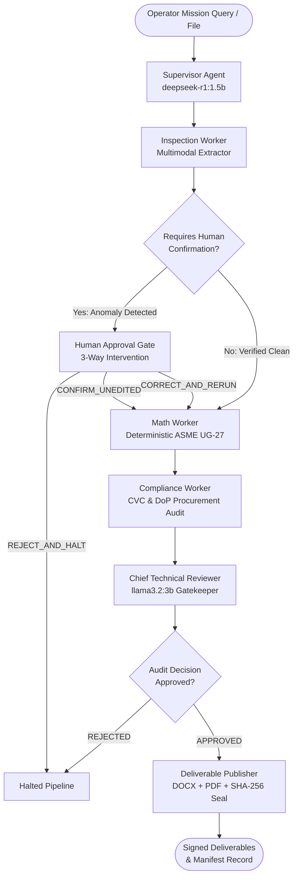

# AegisForge-AI: Sovereign Air-Gapped Multi-Agent AI Workbench for PSUs & Critical Infrastructure

> **Self-hosted, air-gapped agentic AI workbench running entirely on on-premises infrastructure with zero data leakage, deterministic engineering math, and statutory CVC/DoP compliance.**

[](https://www.python.org/)
[](https://github.com/langchain-ai/langgraph)
[](#)
[](#)
[](https://ollama.com/)
[-brightgreen.svg)](#)
[](#)
[](LICENSE)

---

## Executive Summary

Public Sector Undertakings (PSUs) such as **IOCL, ONGC, BPCL, HPCL, GAIL, NTPC**, defense manufacturing units (**DRDO, HAL, BEL**), and statutory safety directorates (**PESO, OISD, CVC**) handle confidential operational data, ultrasonic thickness survey grids, and high-value procurement notes. None of this sensitive IP can ever be transmitted to public cloud LLMs due to national data sovereignty laws, corporate air-gap mandates, and life-safety liabilities.

**AegisForge-AI** provides an industrial-grade, fully sovereign, multi-agent AI workbench that:
1. **Never Hallucinates Engineering Math**: Engineering arithmetic (ASME Section VIII Div 1 UG-27 minimum wall thickness, derated MAWP, corrosion rates) is strictly calculated by deterministic Python engines. LLMs **never** calculate numbers.
2. **Enforces Causal Regulatory Governance**: Statutory CVC Circular 02/02/2004 emergency single-source procurement justifications are causally locked to verified structural breach calculations ($\Delta < 0.0\text{ mm}$). Structurally safe vessels ($\Delta \ge 0.0\text{ mm}$) strictly block emergency single-source procurement.
3. **Mandates a 3-Way Human Approval Gate**: Anomalies or unphysical readings ($CR > 3.0\text{ mm/yr}$, $t > 300\text{ mm}$) trigger an immediate pipeline halt (`GATE_WAITING_HUMAN`) supporting `CONFIRM_UNEDITED`, `CORRECT_AND_RERUN`, or `REJECT_AND_HALT`. Every human intervention is cryptographically chained into an unbroken SHA-256 audit ledger.
4. **Guarantees Fail-Fast Model Outage Resilience**: If the local Ollama daemon crashes or becomes unreachable, the pipeline halts immediately (`HALTED_OLLAMA_SERVICE_UNAVAILABLE`) with zero deliverables generated—completely eliminating unsafe pseudo-heuristic fallbacks.
5. **Compiles Signed Executive Deliverables**: Emits native, cryptographically sealed Microsoft Word (`.docx`) and Adobe PDF (`.pdf`) Notes for Approval, anchored to a tamper-evident `deliverable_manifest.json`.

---

## 4-Stage Multi-Agent Architecture (LangGraph)

AegisForge-AI uses LangGraph to coordinate specialized local models (`deepseek-r1:1.5b`, `llama3.2:3b`, `qwen2.5-coder:1.5b`) with deterministic industrial tools:



### Architectural & Governance Guarantees

| Guarantee | Enforcement Mechanism | Failure / Violation Behavior |
| :--- | :--- | :--- |
| **Zero Math Hallucination** | Small local models are strictly restricted to parsing and synthesis. All calculations pass through `tools/ug27_core.py`. | LLMs are not permitted to compute or alter numerical values. |
| **Causal Compliance** | `ComplianceWorker` consumes validated `calculation_data`. | Emergency single-source is rejected with `NON_COMPLIANT_CVC_VIOLATION` if $\Delta \ge 0.0\text{ mm}$. |
| **PAC Registry Verification** | PAC certificates cited in procurement claims are checked against `VERIFIED_PAC_REGISTRY`. | Hallucinated or expired PACs trigger `EXPIRED_PAC_VIOLATION` and halt the review gate. |
| **Conservative Parameter Guard** | Joint efficiency ($E$) and corrosion allowance ($CA$) are mandatory `required_keys` in `routing_guard.py`. | Dispatch is blocked if non-conservative defaults ($E=1.0, CA=0.0$) are assumed without verification. |
| **3-Way Human Gate Recovery** | Operator can confirm original data, inject corrected values, or reject. Corrected values are protected from re-extraction overwrite. | Halted pipeline (`GATE_WAITING_HUMAN`) recovers cleanly into `MathWorker` with audit trail block hash. |
| **Process-Tree Air Gap** | `network_verifier.py` inspects active Python process sockets. | Throws `ALERT_HOST_EXTERNAL_CONNECTIONS_DETECTED` or passes `PASS_PROCESS_AIR_GAP_VERIFIED`. |
| **Cryptographic Audit Ledger** | Every tool execution and human override is hash-chained via $\text{SHA256}(\text{prev\_hash} + \text{canonical\_payload})$. | Any tampering, deletion, or modification is flagged with exact entry index identification. |

---

## Exhaustive Workspace Catalog

```
c:/Users/rahul/SIH-antigravity-offline/
├── agent_orchestrator/                # LangGraph 4-Stage Multi-Agent System
│   ├── base_agent.py                  # Ollama caller with timeout, <think> stripper, & fail-fast outage exception
│   ├── multi_agent_graph.py           # Compiled LangGraph state graph with conditional edges & recovery paths
│   ├── supervisor_agent.py            # Mission planner (DeepSeek-R1) decomposing goals into industrial stages
│   ├── reviewer_agent.py              # Chief Technical Reviewer gatekeeper (Llama-3.2) auditing math & compliance
│   ├── publisher_agent.py             # Emits signed DOCX/PDF deliverables, computes SHA-256, & updates manifest
│   ├── state.py                       # MultiAgentSystemState TypedDict data contracts
│   └── workers/
│       ├── inspection_worker.py       # Multimodal extraction worker with parameter preservation guard
│       ├── math_worker.py             # Strict deterministic ASME Section VIII calculation worker
│       └── compliance_worker.py       # CVC 02/02/2004 & IOCL DoP 4.2 statutory compliance auditor
│
├── tools/                             # 12 Verified Sovereign Industrial Tools
│   ├── asme_calculator.py             # ASME UG-27 calculation facade
│   ├── ug27_core.py                   # Pure deterministic math engine ($t_{req}$, $\Delta$, $P_{MAWP}$, remaining life)
│   ├── thickness_grid_analyzer.py     # Multi-point ultrasonic thickness survey grid analyzer (UT grid scans)
│   ├── compliance_auditor.py          # Statutory CVC & DoP procurement delegation matrix auditor
│   ├── routing_guard.py               # Human confirmation routing guard & 3-way override state machine
│   ├── audit_trail.py                 # Tamper-evident SHA-256 hash-chained JSONL audit ledger
│   ├── network_verifier.py            # Dual-scope (process-tree vs. host) passive air-gap telemetry probe
│   ├── inspection_extractor_tool.py   # Deterministic inspection parameter parser & anomaly sanity gate
│   ├── sandbox.py                     # Subprocess-isolated, AST-allowlisted Python computational sandbox
│   ├── rag.py                         # Sovereign local retrieval augmented generation (Qdrant vector + keyword)
│   ├── file_io.py                     # Path-traversal defended workspace file read/write tool
│   └── doc_generator.py               # Unified document compiler and cryptographic hashing wrapper
│
├── database/                          # Embedded Sovereign Vector Database
│   ├── qdrant_manager.py              # Pure local disk-embedded Qdrant vector & hybrid retrieval client
│   └── __init__.py                    # Client export facade
│
├── ingestion/                         # Multimodal & Inspection Report Ingestion
│   └── multimodal_parser.py           # EasyOCR + PDF/DOCX structured table & text parser
│
├── output_generation/                 # Native Document Compilers
│   ├── docx_generator.py              # Native Microsoft Word (.docx) Note for Approval compiler
│   └── pdf_generator.py               # Native Adobe PDF (.pdf) Note for Approval compiler (ReportLab)
│
├── models/                            # Sovereign Model Management & Routing
│   ├── model_downloader.py            # Local Ollama & EasyOCR model weight manager and health checker
│   └── router/
│       └── model_router.py            # Dynamic task classifier routing between coding, reasoning, & summary
│
├── config/                            # Environment & Architecture Settings
│   └── settings.py                    # Root paths, model registries, thresholds, and logging setup
│
├── schemas/                           # Pydantic Data Contracts
│   └── mvp_schema.py                  # InspectionInput, CalculationOutput, ReasoningOutput, FinalNFAPayload
│
├── tests/                             # Comprehensive Automated Verification Suites
│   ├── test_sovereign_toolset.py      # 11 Unit & Boundary Test Suites for all tools (100% Pass)
│   └── test_multi_agent_system.py     # 7 End-to-End Multi-Agent Integration Tests (100% Pass)
│
├── data/                              # Sovereign Data & Runtime Assets
│   ├── logs/                          # sovereign_audit_ledger.jsonl (hash-chained) & runtime logs
│   ├── output/                        # Signed deliverables (.docx, .pdf) & deliverable_manifest.json
│   ├── vector_storage/                # Embedded local Qdrant SQLite database
│   └── scratch/                       # Isolated ephemeral scratch storage
│
├── frontend/                          # Web UI Dashboard
│   └── app.py                         # Streamlit application (Workbench, ASME Calculator, Model Hub)
│
└── main.py                            # Central CLI Operating Gateway
```

---

## Comprehensive Verification & Test Suite

Both automated test suites pass with **100% success (18 / 18 Tests Passing)**:

### 1. Sovereign Toolset Verification (`tests/test_sovereign_toolset.py`)

```text
  [PASS] Test 01: All 9 tools exported cleanly without import errors.
  [PASS] Test 02: ASME UG-27 baseline math, breach detection, zero-margin alert, & boundary failure modes.
  [PASS] Test 03: AST allowlist sandbox blocks OS, socket, subprocess, urllib, & infinite loops.
  [PASS] Test 04: File I/O strictly blocks relative path traversal attacks (../../escape).
  [PASS] Test 05: Multi-point thickness grid analyzer audits 6 points, pinpoints worst breach location.
  [PASS] Test 06: CVC compliance engine rejects unsubstantiated PAC and hallucinated PAC identifiers.
  [PASS] Test 07: Inspection extractor triggers ACTION_REQUIRED_UNVERIFIED_DATA on unphysical readings.
  [PASS] Test 08: Cryptographic audit ledger maintains unbroken SHA-256 chain and catches byte tampering.
  [PASS] Test 09: Network verifier confirms 0 open non-loopback external sockets on process tree.
  [PASS] Test 10: Deliverables generated in DOCX & PDF format with SHA-256 manifest registration.
  [PASS] Test 11: Routing guard halts dispatch awaiting human confirmation on flagged anomalies.
```

### 2. Multi-Agent Orchestration Integration (`tests/test_multi_agent_system.py`)

```text
  [PASS] Test 01: Golden Path End-to-End (Supervisor → Inspection → Math → Compliance → Reviewer → Publisher).
  [PASS] Test 02: Anomaly Gating & Halting (Pipeline halts cleanly with status=GATE_WAITING_HUMAN).
  [PASS] Test 03: Human Approval Recovery (CORRECT_AND_RERUN injects values, anchors SHA-256 ledger block).
  [PASS] Test 04: Human Approval Recovery (CONFIRM_UNEDITED authorizes calculation on original values).
  [PASS] Test 05: Compliance Causal Dependency (Safe vessel delta=+16.43 mm rejects emergency single-source).
  [PASS] Test 06: PAC Expiry Rejection (Chief Reviewer gatekeeper halts on expired PAC certificate).
  [PASS] Test 07: Local Ollama Outage Fail-Fast Check (Halts with HALTED_OLLAMA_SERVICE_UNAVAILABLE).
```

---

## Deterministic Engineering Math (ASME Section VIII Div 1 UG-27)

Wall thickness calculations follow the ASME Boiler and Pressure Vessel Code (BPVC) standard:

$$t_{req} = \frac{P \times R}{S \times E - 0.6 \times P} + CA$$

Where:
- $P$ = Internal Design Pressure ($\text{MPa}$)
- $R$ = Inside Radius of Shell ($\text{mm}$)
- $S$ = Maximum Allowable Stress ($\text{MPa}$)
- $E$ = Joint Efficiency ($0.0 < E \le 1.0$)
- $CA$ = Specified Corrosion Allowance ($\text{mm}$)

**Derated Maximum Allowable Working Pressure (MAWP):**
$$P_{MAWP} = \frac{S \times E \times t_{actual}}{R + 0.6 \times t_{actual}}$$

**Margin Analysis & Boundary Decisions:**
- $\Delta = t_{actual} - t_{req}$
- If $\Delta < 0.0$: **`CRITICAL_BREACH`** (Mandatory statutory code violation).
- If $\Delta == 0.0$: **`MARGINAL_ALERT (ZERO SAFETY MARGIN)`** (Flagged for operational review).
- If $\Delta > 0.0$: **`SAFE`** (Vessel meets code minimum).

---

## Quick Start Guide

### 1. Environment Setup

```bash
# Clone the repository
git clone https://github.com/Shivanshvyas1729/AegisForge-AI.git
cd AegisForge-AI

# Install dependencies
pip install -r requirements.txt
```

### 2. Configure Local Models with Ollama

Ensure [Ollama](https://ollama.com/) is installed and running on `http://127.0.0.1:11434`:

```bash
ollama pull deepseek-r1:1.5b
ollama pull llama3.2:3b
ollama pull qwen2.5-coder:1.5b
```

### 3. Run Automated Verification Suites

```bash
# Verify all sovereign tools & security hardening
python tests/test_sovereign_toolset.py

# Verify the full 4-stage multi-agent orchestration pipeline
python tests/test_multi_agent_system.py
```

### 4. Launch the Application

```bash
# Launch the Streamlit Web Dashboard
python main.py ui

# Run the central CLI operating menu
python main.py
```

---

## Target Industry Sectors & Regulatory Compliance

- **Oil & Gas Refineries**: Indian Oil Corporation Ltd (IOCL), ONGC, BPCL, HPCL, GAIL
- **Power & Heavy Engineering**: NTPC, BHEL, Power Grid Corporation of India
- **Defence & Strategic Infrastructure**: DRDO, Bharat Electronics Ltd (BEL), Hindustan Aeronautics Ltd (HAL)
- **Governing Regulatory Standards**:
  - **ASME BPVC Section VIII Div 1 (UG-27)**: Rules for Construction of Pressure Vessels.
  - **API 510**: Pressure Vessel Inspection Code: In-service Inspection, Rating, Repair, and Alteration.
  - **CVC Circular No. 02/02/2004**: Guidelines on Tendering & Single-Source Procurement in PSUs.
  - **IOCL Delegation of Powers (DoP) Clause 4.2**: Emergency Procurement Authorities.

---

## License

This project is licensed under the [MIT License](LICENSE).