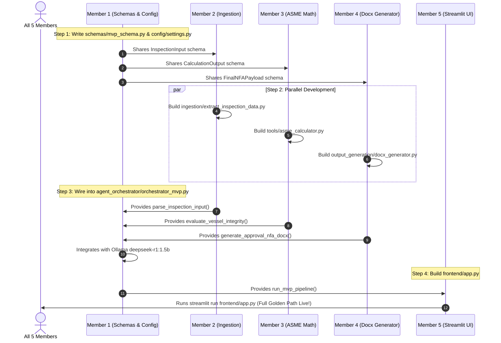

# AegisForge-AI: Team Task Division & MVP Execution Plan

> **Team Size:** 5 Members  
> **Strategy:** **MVP First** — Focus 100% on the single Golden Path workflow before adding complex features.  
> **Target MVP Workflow:** **Inspection Defect Ingestion → ASME Code Math Verification → Local DeepSeek-R1 Synthesis → Native Word (.docx) Note for Approval Generation → Streamlit Demo UI.**  
> **Last Status Audit:** 2026-09-14 — Baseline models, datasets, and docs complete; MVP core modules pending implementation.

---

## 📊 Project Status: What is Done vs. What is Left

### ✅ What is ALREADY DONE (Existing Foundations)
The foundation and benchmark assets are complete and ready for the team to use:
- [x] **Sample Datasets Across 6 Categories:** Located in [`sample_data/`](sample_data) (NFAs, board presentations, ASME memos, SCADA scripts, P&ID drawings, and ultrasonic inspection logs).
- [x] **Document Compiler Engine:** Pure Python standard library OpenXML generator in [`sample_data/generate_sample_documents.py`](sample_data/generate_sample_documents.py) and [`sample_data/build_samples.bat`](sample_data/build_samples.bat).
- [x] **Dynamic Model Router:** Heuristic classifier and Ollama caller in [`models/router/model_router.py`](models/router/model_router.py).
- [x] **Vision OCR Pipeline:** EasyOCR and SVG rasterization scripts in [`models/vision_models/`](models/vision_models).
- [x] **Reasoning Test Harness:** DeepSeek-R1 evaluation script in [`models/reasoning_models/test_reasoning.py`](models/reasoning_models/test_reasoning.py).
- [x] **Root Documentation & Dependencies:** PyTorch CUDA 12.4 and Ollama configs in [`requirements.txt`](requirements.txt) and [`README.md`](README.md).

---

### 🔴 What is LEFT TO DO (Action Items for MVP)

To have a fully working, 100% functional end-to-end MVP demonstration, the following **7 specific files** are remaining to be built:

| Priority | Component / File | Owner | Status | Purpose |
| :---: | :--- | :--- | :---: | :--- |
| **P0** | [`schemas/mvp_schema.py`](schemas) | **Member 1** (Shared) | 🔴 **LEFT TO DO** | Shared Pydantic data schemas connecting all 5 members. |
| **P0** | [`config/settings.py`](config) | **Member 1** | 🔴 **LEFT TO DO** | Local Ollama endpoints, model IDs, and paths. |
| **P1** | [`tools/asme_calculator.py`](tools) | **Member 3** | 🔴 **LEFT TO DO** | ASME UG-27 $t_{\text{min}}$ formula & API 510 remaining life calculator. |
| **P1** | [`ingestion/extract_inspection_data.py`](ingestion) | **Member 2** | 🔴 **LEFT TO DO** | Parser extracting vessel parameters from raw field inspection OCR log. |
| **P1** | [`output_generation/docx_generator.py`](output_generation) | **Member 4** | 🔴 **LEFT TO DO** | Native Word `.docx` generator compiling formatted PSU approval note. |
| **P2** | [`agent_orchestrator/orchestrator_mvp.py`](agent_orchestrator) | **Member 1** | 🔴 **LEFT TO DO** | Central coordinator tying Ingestion → Math → Ollama → Word document. |
| **P2** | [`frontend/app.py`](frontend) | **Member 5** | 🔴 **LEFT TO DO** | Streamlit web demo with step-by-step progress cards and download button. |
| **P3** | [`tests/test_mvp_pipeline.py`](tests) | **Integration** | 🔴 **LEFT TO DO** | Automated integration test validating zero-crash end-to-end flow. |

---

## 🗂️ Folder Structure & Member Ownership Map

```
AegisForge-AI/
│
├── agent_orchestrator/
│   ├── .gitkeep                         <-- [DONE]
│   └── orchestrator_mvp.py              <-- 🔴 [MEMBER 1: LEFT TO DO] Main pipeline controller
│
├── config/
│   ├── .gitkeep                         <-- [DONE]
│   └── settings.py                      <-- 🔴 [MEMBER 1: LEFT TO DO] Ollama endpoint & model registry
│
├── data/
│   ├── uploads/                         <-- [DONE] Destination for uploaded logs & images
│   └── (output deliverables)            <-- [RUNTIME] Destination for generated .docx files
│
├── frontend/
│   ├── .gitkeep                         <-- [DONE]
│   └── app.py                           <-- 🔴 [MEMBER 5: LEFT TO DO] Streamlit UI demo dashboard
│
├── ingestion/
│   ├── .gitkeep                         <-- [DONE]
│   └── extract_inspection_data.py       <-- 🔴 [MEMBER 2: LEFT TO DO] Field OCR log parameter extractor
│
├── models/
│   ├── reasoning_models/
│   │   └── test_reasoning.py            <-- [DONE] DeepSeek-R1 test harness
│   ├── router/
│   │   └── model_router.py              <-- [DONE] Dynamic task classifier & Ollama router
│   └── vision_models/
│       ├── convert_svg.py               <-- [DONE] SVG rasterizer
│       ├── test_easyocr.py              <-- [DONE] P&ID blueprint OCR reader
│       ├── test_summary.md              <-- [DONE] Vision architecture notes
│       └── test_vision_vlm.py           <-- [DONE] Multimodal VLM test
│
├── output_generation/
│   ├── .gitkeep                         <-- [DONE]
│   └── docx_generator.py                <-- 🔴 [MEMBER 4: LEFT TO DO] Word (.docx) approval note compiler
│
├── sample_data/                         <-- [DONE] Gold-standard industrial datasets (01 to 06)
│   ├── build_samples.bat                <-- [DONE] One-click document generator
│   ├── generate_sample_documents.py     <-- [DONE] OpenXML standard-library compiler reference
│   └── 06_inspection_reports/
│       └── field_inspector_raw_ocr_log.txt <-- [DONE] Source input for the MVP pipeline
│
├── schemas/
│   ├── .gitkeep                         <-- [DONE]
│   └── mvp_schema.py                    <-- 🔴 [MEMBER 1: LEFT TO DO] Pydantic data interface
│
├── tests/
│   ├── .gitkeep                         <-- [DONE]
│   └── test_mvp_pipeline.py             <-- 🔴 [INTEGRATION: LEFT TO DO] End-to-end regression test
│
└── tools/
    ├── .gitkeep                         <-- [DONE]
    └── asme_calculator.py               <-- 🔴 [MEMBER 3: LEFT TO DO] ASME UG-27 math verification engine
```

---

## 👥 Detailed Action Checklist for Each Team Member

---

### 👤 Member 1: Orchestrator & Local Model Routing
- **Assigned Directories:** [`agent_orchestrator/`](agent_orchestrator), [`config/`](config), [`schemas/`](schemas)
- **Status:** 🔴 **LEFT TO DO**
- **Existing Files to Use:** [`models/router/model_router.py`](models/router/model_router.py), [`models/reasoning_models/test_reasoning.py`](models/reasoning_models/test_reasoning.py)
- **What is Left to Implement:**
  1. [ ] Create `schemas/mvp_schema.py` containing Pydantic models: `InspectionInput`, `CalculationOutput`, `ReasoningOutput`, `FinalNFAPayload`. *(Priority 0 - required by everyone)*
  2. [ ] Create `config/settings.py` defining `OLLAMA_BASE_URL = "http://127.0.0.1:11434"`, `DEFAULT_REASONING_MODEL = "deepseek-r1:1.5b"`, `FALLBACK_MODEL = "llama3.2:3b"`, and default paths.
  3. [ ] Create `agent_orchestrator/orchestrator_mvp.py` with function `run_mvp_pipeline(input_source: str) -> FinalNFAPayload`:
     - Calls Member 2's `parse_inspection_input()`
     - Calls Member 3's `evaluate_vessel_integrity()`
     - Builds structured engineering context prompt
     - Calls local Ollama `deepseek-r1:1.5b` for executive justification
     - Calls Member 4's `generate_approval_nfa_docx()`
     - Returns final validated payload
- **Definition of Done (DoD):** Running `python agent_orchestrator/orchestrator_mvp.py` completes without exceptions and saves a valid `.docx` in `data/`.

---

### 👤 Member 2: Ingestion & Data Extraction
- **Assigned Directory:** [`ingestion/`](ingestion)
- **Status:** 🔴 **LEFT TO DO**
- **Existing Files to Use:** [`sample_data/06_inspection_reports/field_inspector_raw_ocr_log.txt`](sample_data/06_inspection_reports/field_inspector_raw_ocr_log.txt), [`models/vision_models/test_easyocr.py`](models/vision_models/test_easyocr.py)
- **What is Left to Implement:**
  1. [ ] Create `ingestion/extract_inspection_data.py`.
  2. [ ] Implement function `parse_inspection_input(file_path_or_text: str) -> InspectionInput`:
     - Reads raw text or noisy OCR log.
     - Uses regex/string patterns to extract:
       - Equipment ID: `11-V-102` (HP Separator)
       - Material: `SA-387 Gr 22 Cl 2`
       - Design Pressure: `14.5` MPa
       - Inside Radius: `1200.0` mm
       - Allowable Stress: `138.0` MPa
       - Joint Efficiency: `1.0`
       - Corrosion Allowance: `4.0` mm
       - Critical Point: `Point BK-01`
       - Measured Thickness: `138.20` mm
       - Corrosion Rate: `0.75` mm/yr
     - Validates and returns a clean `InspectionInput` Pydantic instance.
- **Definition of Done (DoD):** Running `python ingestion/extract_inspection_data.py` outputs a dictionary with `measured_thickness_mm == 138.20` and `equipment_id == "11-V-102"`.

---

### 👤 Member 3: Engineering Physics & Math Tool
- **Assigned Directory:** [`tools/`](tools)
- **Status:** 🔴 **LEFT TO DO**
- **Existing Files to Use:** [`sample_data/03_engineering_calculations/engineering_design_basis_memo.md`](sample_data/03_engineering_calculations/engineering_design_basis_memo.md), [`sample_data/03_engineering_calculations/ASME_Pressure_Vessel_Thickness_Calc.xlsx`](sample_data/03_engineering_calculations/ASME_Pressure_Vessel_Thickness_Calc.xlsx)
- **What is Left to Implement:**
  1. [ ] Create `tools/asme_calculator.py`.
  2. [ ] Implement function `evaluate_vessel_integrity(inp: InspectionInput) -> CalculationOutput`:
     - Computes ASME Sec VIII Div 1 UG-27 formula:
       $$t_{\text{req}} = \frac{P \cdot R}{S \cdot E - 0.6 \cdot P} + CA = \frac{14.5 \cdot 1200}{138.0 \cdot 1.0 - 0.6 \cdot 14.5} + 4.0 = 138.57\text{ mm}$$
     - Calculates delta: $\Delta = t_{\text{actual}} - t_{\text{req}} = 138.20 - 138.57 = -0.37\text{ mm}$.
     - Flags `is_breach = True` if $\Delta < 0$.
     - Computes API 510 remaining life: $\text{Life} = \frac{138.20 - 138.57}{0.75} = -0.49\text{ Years}$.
     - Computes derated allowable working pressure (MAWP).
     - Returns validated `CalculationOutput` instance.
- **Definition of Done (DoD):** Running `python tools/asme_calculator.py` prints `t_min: 138.57`, `delta: -0.37`, and `is_breach: True`.

---

### 👤 Member 4: Word Deliverable (.docx) Compiler
- **Assigned Directory:** [`output_generation/`](output_generation)
- **Status:** 🔴 **LEFT TO DO**
- **Existing Files to Use:** [`sample_data/generate_sample_documents.py`](sample_data/generate_sample_documents.py), [`sample_data/01_approval_notes/IOCL_Refinery_Pump_Overhaul_Note.md`](sample_data/01_approval_notes/IOCL_Refinery_Pump_Overhaul_Note.md)
- **What is Left to Implement:**
  1. [ ] Create `output_generation/docx_generator.py`.
  2. [ ] Implement function `generate_approval_nfa_docx(payload: dict, output_path: str) -> str`:
     - Uses `python-docx` or standard-library OpenXML logic from `generate_sample_documents.py`.
     - Formats executive PSU Note for Approval layout:
       - Header: INDIAN OIL CORPORATION LIMITED / REFINERIES DIVISION
       - Classification: "RESTRICTED / INTERNAL USE ONLY"
       - Section 1: Background & NDT Ultrasonic Survey Defect Discovery
       - Section 2: Statutory Code Calculations & Safety Margin Breach (Table with $138.20\text{ mm}$ vs $138.57\text{ mm}$)
       - Section 3: CVC PAC Guidelines & Emergency Procurement Justification
       - Section 4: Recommended Corrective Action & Financial Sanction (₹88.0 Lakhs)
       - Section 5: Signature Block & Competent Financial Authority (ED / GM)
     - Saves the file to `output_path` and returns the file path.
- **Definition of Done (DoD):** Running `python output_generation/docx_generator.py` produces a valid `.docx` file in `data/` that opens without errors in Microsoft Word.

---

### 👤 Member 5: Frontend Dashboard & Air-Gap Demo Experience
- **Assigned Directory:** [`frontend/`](frontend)
- **Status:** 🔴 **LEFT TO DO**
- **Existing Files to Use:** [`sample_data/06_inspection_reports/field_inspector_raw_ocr_log.txt`](sample_data/06_inspection_reports/field_inspector_raw_ocr_log.txt)
- **What is Left to Implement:**
  1. [ ] Create `frontend/app.py`.
  2. [ ] Build the Streamlit dashboard layout:
     - **Header & Badges:** "AegisForge-AI: Sovereign Air-Gapped PSU Workbench", `🔒 100% On-Premises | Zero Cloud Transmission`.
     - **Sidebar:** System status (Ollama connection indicator, model: `deepseek-r1:1.5b`), test sample selector dropdown.
     - **Main Workspace:**
       - File uploader or "Load Sample Inspection Log" button.
       - "⚡ Run Sovereign Analysis" trigger button.
       - Visual 4-Step Stepper Cards:
         - Card 1: 📄 Ingestion Output (displays extracted equipment parameters).
         - Card 2: ⚠️ ASME Engineering Calculation (red alert card highlighting $-0.37\text{ mm}$ violation).
         - Card 3: 🧠 Local DeepSeek-R1 Reasoning (streamed/displayed chain-of-thought).
         - Card 4: 📝 Generated Office Deliverable (`.docx`).
       - Download button: `📥 Download Formal Note for Approval (.docx)`.
- **Definition of Done (DoD):** Running `streamlit run frontend/app.py` launches in the browser, executes the complete pipeline on click, and downloads the generated Word document.

---

## ⚡ Execution Order: How to Build What's Left (Step-by-Step)

To complete the remaining files without blocking each other, follow this exact sequence:



---

## 🚫 What We are NOT Doing (Deferred Past the MVP)

Do **NOT** spend time on these items until the 7 remaining files above are working:

| Deferred Feature | Target Directory | Why It Is Deferred |
| :--- | :--- | :--- |
| **ChromaDB / FAISS Vector RAG** | `data/vector_storage/` | Static domain prompts are faster and deterministic for the MVP demo. |
| **Linux Kernel `unshare -n` Sandbox** | `network_isolation/` | Complex to run on Windows development machines. |
| **REST API Server (FastAPI)** | `routing_api/`, `backend/` | Direct Python function imports into Streamlit demo are faster to test. |
| **User Login & Database Auth** | `backend/` | Unnecessary overhead for the functional proof-of-concept. |
| **Model Fine-Tuning** | `models/` | Open-weight GGUF/Ollama models are already capable of solving the task. |
