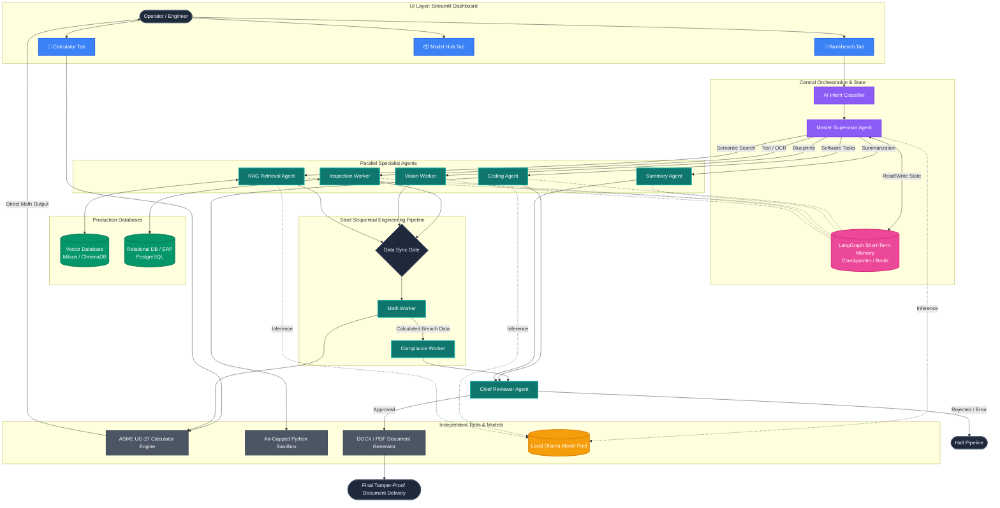

# AegisForge-AI: Production-Grade Architecture & Flow Analysis

This document outlines the **fully production-grade system architecture** of AegisForge-AI. Based on advanced design requirements, this architecture incorporates:
1. **Master Supervisor Routing:** All intents (Coding, Summary, Reasoning, etc.) are now managed by a central Master Supervisor Agent.
2. **LangGraph Short-Term Memory:** Implemented across the pipeline to give agents context of previous turns and intermediate states.
3. **Retrieval-Augmented Generation (RAG):** Added a dedicated RAG Agent and a Vector Database (e.g., Milvus/ChromaDB) for semantic search over historical manuals and guidelines.

---

## 1. System Components

- **Short-Term Memory (LangGraph Checkpointer):** Acts as the brain of the workflow. The Master Supervisor and all child workers read/write to this memory state, enabling multi-step contextual awareness.
- **Data Layer (Vector & Relational DBs):** 
  - **Vector DB:** Stores embeddings of API manuals, CVC guidelines, and past inspection reports for the RAG Agent.
  - **Relational DB (PostgreSQL):** Stores historical ERP and maintenance logs.
- **Master Supervisor Agent:** Dispatches tasks to specific specialist agents (Coding Agent, Summary Agent, RAG Agent, etc.) based on the classifier's intent.
- **Deterministic Tools (ASME Calculator):** Provides calculation-based answers directly from the formula logic without secondary LLM verification to ensure purely deterministic outputs.

---

## 2. Production-Grade Architecture Map

Below is the highly scalable, production-ready architecture demonstrating the flow between Memory, Data, Agents, and Tools.

## 3. Key Upgrades Explained

### A. The Master Supervisor & Unified Workflow
Instead of the classifier sending tasks out of the LangGraph ecosystem, **everything** is now managed by a LangGraph `Master Supervisor Agent`. If the user asks for code, the Supervisor hands it to the `Coding Agent`. If the user asks a general question, it hands it to the `Summary Agent`. 

### B. Short-Term Memory (LangGraph Checkpointer)
The pink **Memory** module represents LangGraph's `checkpointer` (often backed by SQLite or Redis in production). 
- **How it connects:** The Supervisor and all worker agents read from and write to this shared state. If the user refers to "that vessel from my last message", the Supervisor queries the Short-Term Memory to provide the exact context to the workers.

### C. RAG and Vector Databases
A new **RAG Retrieval Agent** is connected directly to a **Vector Database** (green). 
- **Usage:** When the `Compliance Worker` or `Summary Agent` needs to know the exact text of "OISD Standard 116", the Supervisor asks the RAG Agent to perform a semantic similarity search in the Vector DB. The RAG Agent retrieves the chunks and places them into the Short-Term Memory for the other agents to use.

### D. Purely Deterministic Calculator Output
The ASME calculation engine outputs its answers purely based on its internal mathematical logic. When the `Math Worker` or the `Calc UI Tab` interfaces with it, it returns the raw calculated minimum thickness parameters directly without subjecting the numbers to secondary LLM verification, preserving mathematical determinism.
