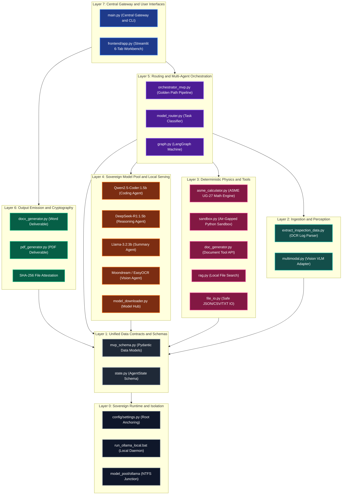
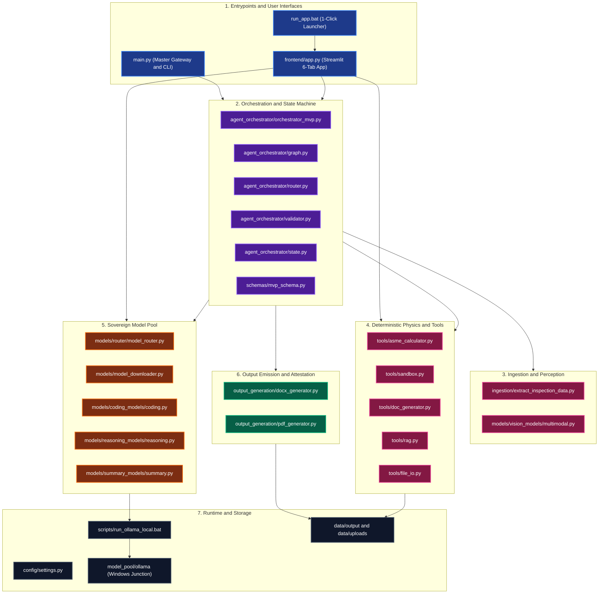
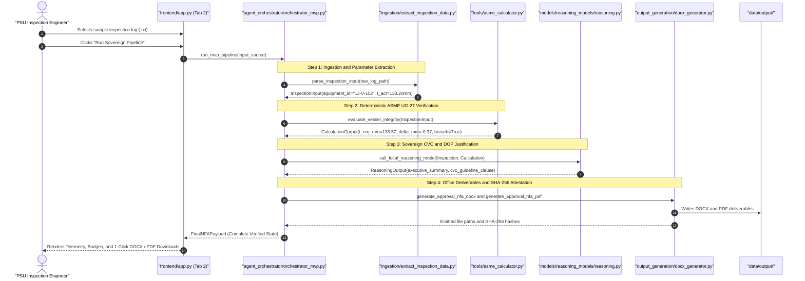
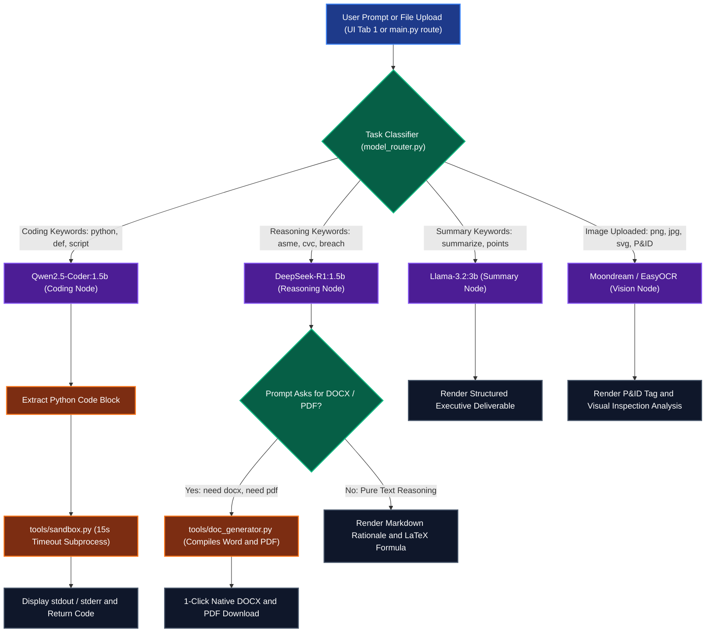
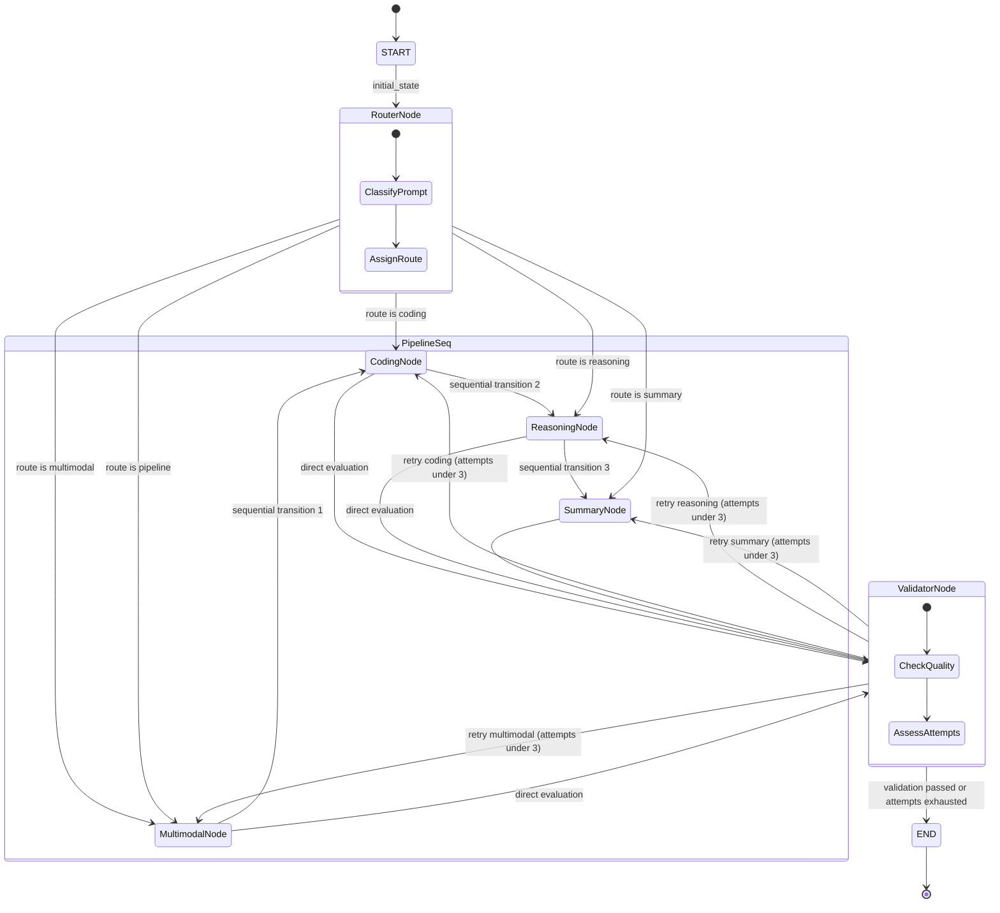
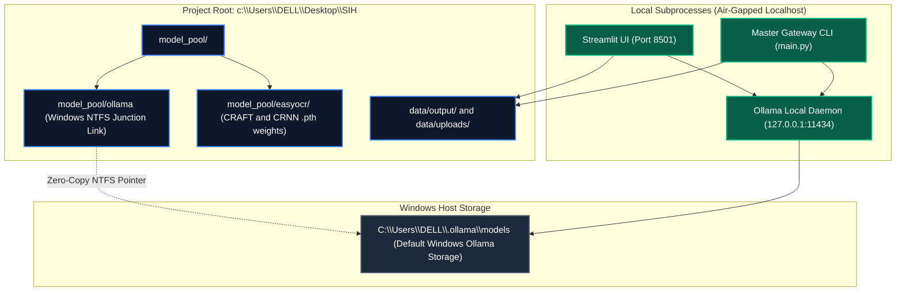

# 🛡️ AegisForge-AI: Complete End-to-End Architecture & System Flow Specification
**Document ID:** `rahul_check`  
**Target Audience:** Engineering Leads, Architecture Reviewers, PSU Process Safety Auditors  
**System:** AegisForge-AI — 100% Air-Gapped Sovereign Industrial AI & Engineering Workbench  
**Root Path:** `c:\Users\DELL\Desktop\SIH`  
**Visual Browser Viewer:** Open [`architecture_viewer.html`](file:///c:/Users/DELL/Desktop/SIH/architecture_viewer.html) in your browser to interactively view and zoom all diagrams!

> [!TIP]
> **Viewing in VS Code:**  
> Press **`Ctrl + Shift + V`** (or **`Ctrl + K, V`**) to open the visual **Markdown Preview** side-by-side.

---

## 1. Executive Summary & Core System Guarantees

AegisForge-AI is an air-gapped, zero-cloud sovereign industrial engineering platform purpose-built for Indian Public Sector Undertakings (IOCL, ONGC, GAIL, NTPC, etc.). It automates statutory asset integrity audits, engineering calculations (ASME Section VIII, API 510), compliance justification (CVC guidelines, DOP Clause 4.2), and tamper-evident official document generation.

### Key Guarantees:
1. **100% Air-Gapped and Sovereign**: Zero telemetry or external API calls. All LLMs, VLMs, and OCR models run on `localhost:11434` or local PyTorch runtimes.
2. **Deterministic Physics Enforcement**: Critical safety equations ($t_{\text{min}}$, safety delta, API 510 remaining service life, derated MAWP) are calculated using pure deterministic Python mathematics rather than probabilistic LLM hallucinations.
3. **Cryptographic Tamper Attestation**: Every generated Microsoft Word (`.docx`) and Adobe PDF (`.pdf`) document is automatically stamped with a SHA-256 cryptographic hash.
4. **Zero Host Pollution**: Storage is strictly encapsulated within the project directory. The model pool uses an NTFS Windows Junction (`model_pool\ollama` pointing to `C:\Users\DELL\.ollama\models`) ensuring portability and clean uninstallation.

---

## 2. End-to-End 7-Layer Structural Hierarchy

AegisForge-AI is structured into 7 distinct, decoupled layers:



---

## 3. Complete Component & File-by-File Directory Map

The entire system is modularly organized into 7 functional clusters:



### 📁 Clean Hierarchical Component Tree

```text
c:\Users\DELL\Desktop\SIH\
│
├── 🚀 1. GATEWAY & USER INTERFACES (Layer 7)
│   ├── main.py                               # Central Master Gateway, CLI commands & programmatic engine
│   ├── run_app.bat                           # 1-Click launcher: ensures Ollama is active & starts Streamlit UI
│   └── frontend/
│       └── app.py                            # Streamlit 6-Tab Sovereign Workbench (Router, MVP, Calc, Sandbox, Models, Info)
│
├── 🧠 2. AGENT ORCHESTRATION & STATE (Layers 5 & 1)
│   ├── schemas/
│   │   └── mvp_schema.py                     # Pydantic contracts: InspectionInput, CalculationOutput, ReasoningOutput, FinalNFAPayload
│   └── agent_orchestrator/
│       ├── orchestrator_mvp.py               # Golden Path coordinator: Ingest -> ASME Math -> DeepSeek-R1 -> Word/PDF
│       ├── graph.py                          # LangGraph StateGraph compiling router, coding, reasoning, summary, and multimodal nodes
│       ├── router.py                         # Heuristic prompt classification & routing decision node
│       ├── validator.py                      # Multi-agent output validator with retry & loopback logic
│       └── state.py                          # TypedDict AgentState schema passing prompt, files, routes, and messages
│
├── 📥 3. INGESTION & PERCEPTION (Layer 2)
│   └── ingestion/
│       └── extract_inspection_data.py        # Regex parser extracting equipment ID, thickness, pressure, material from raw OCR logs
│
├── 🧮 4. DETERMINISTIC PHYSICS & AIR-GAPPED TOOLS (Layer 3)
│   └── tools/
│       ├── asme_calculator.py                # ASME Section VIII Div 1 UG-27 shell thickness, breach delta & API 510 life calculator
│       ├── sandbox.py                        # Isolated subprocess Python execution engine with strict 15s timeout
│       ├── doc_generator.py                  # High-level tool wrapping .docx and .pdf generation for agents and UI
│       ├── rag.py                            # Sovereign air-gapped text search across sample_data/ documents
│       └── file_io.py                        # Safe reader/writer for local JSON, CSV, and text files
│
├── 🤖 5. SOVEREIGN MODEL POOL & SERVING (Layer 4)
│   └── models/
│       ├── model_downloader.py               # Local model hub manager: streaming downloader, health checks, model purger
│       ├── router/
│       │   └── model_router.py               # SovereignModelRouter & LocalModelHandler for dynamic prompt-to-model dispatching
│       ├── coding_models/coding.py           # Coding agent node using Qwen2.5-Coder:1.5b
│       ├── reasoning_models/reasoning.py     # Reasoning agent node using DeepSeek-R1:1.5b
│       ├── summary_models/summary.py         # Summary agent node using Llama-3.2:3b
│       └── vision_models/multimodal.py       # Vision agent node using Moondream VLM and EasyOCR
│
├── 📄 6. OUTPUT EMISSION & CRYPTOGRAPHY (Layer 6)
│   └── output_generation/
│       ├── docx_generator.py                 # Generates styled Microsoft Word (.docx) Note for Approval with SHA-256 hash
│       └── pdf_generator.py                  # Generates styled Adobe PDF (.pdf) Note for Approval with SHA-256 hash
│
└── 🔒 7. RUNTIME, ISOLATION & STORAGE (Layer 0)
    ├── config/settings.py                    # Root anchor, path definitions, and local model registry mappings
    ├── model_pool/
    │   ├── easyocr/                          # CRAFT & CRNN text recognition weight files (.pth)
    │   └── ollama/                           # Windows NTFS Junction link -> C:\Users\DELL\.ollama\models
    ├── data/
    │   ├── output/                           # Destination folder for generated .docx and .pdf deliverables
    │   └── uploads/                          # User uploaded field logs and engineering drawings
    └── scripts/
        ├── run_ollama_local.bat              # Starts local Ollama daemon on port 11434 with model_pool storage
        ├── setup_models.py                   # Automated model preflight & batch downloader script
        └── clean_models.bat                  # 1-click model purge script to reclaim 100% disk space
```

---

## 4. Flow 1: Golden Path End-to-End Pipeline (Step-by-Step)

The Golden Path executes the complete pipeline: field inspection log ingestion ➔ ASME UG-27 mathematical verification ➔ DeepSeek-R1 sovereign reasoning ➔ Word and PDF compilation with cryptographic attestation.



---

## 5. Flow 2: Sovereign Dynamic Model Router & Execution Engine

When a prompt or task is entered in Tab 1 (`frontend/app.py`) or via `main.py route --prompt "..."`:



---

## 6. Flow 3: LangGraph Multi-Agent State Machine Flow

When multi-agent state orchestration is executed (`agent_orchestrator/graph.py`):



---

## 7. Flow 4: Sovereign Storage & Air-Gapped Windows Junction Model Pool

How model storage, downloads, and inference processes interact with the file system:



---

## 8. Comprehensive File-by-File Technical Directory & Contract Matrix

| File Path | Layer | Primary Class / Function | Inputs Received | Internal Execution | Outputs Emitted | Downstream Consumers |
| :--- | :--- | :--- | :--- | :--- | :--- | :--- |
| `main.py` | **L7** | `AegisForgeCentralEngine`, CLI entry | CLI arguments (`sys.argv`), interactive menu choices | Central coordinator calling all layers (Status, Pipeline, Router, Math, Sandbox, UI) | Console reports, triggers downstream processes | User, Terminal, CI/CD |
| `frontend/app.py` | **L7** | Streamlit Web App (6 Tabs) | User text, uploaded logs/images, slider values | Renders reactive UI, triggers models, compiles downloads, displays math proofs | Interactive DOM, generated `.docx`/`.pdf` download streams | End-user, Refinery Engineers |
| `agent_orchestrator/orchestrator_mvp.py` | **L5** | `run_mvp_pipeline()`, `call_local_reasoning_model()` | `input_source` (path or string), `model_name` | Coordinates Ingestion ➔ Math ➔ DeepSeek-R1 ➔ DOCX/PDF generation | `FinalNFAPayload` (Pydantic model) | `main.py`, `frontend/app.py` (Tab 2) |
| `agent_orchestrator/graph.py` | **L5** | `build_graph()`, routing edge functions | Model handlers (`router_llm`, `coding_llm`, etc.) | Compiles LangGraph `StateGraph(AgentState)` with conditional routing & feedback | Compiled LangGraph runnable graph | `main.py` (`run_langgraph()`), test suites |
| `agent_orchestrator/router.py` | **L5** | `router_node()`, `route_decision()` | `AgentState`, router LLM | Analyzes prompt intent; assigns target route (`coding`, `reasoning`, etc.) | Updated `AgentState["route"]` | LangGraph StateGraph |
| `agent_orchestrator/validator.py` | **L5** | `validator_node()`, `validation_decision()` | `AgentState` | Inspects model outputs for quality/errors; triggers loopback or `END` | Updated `AgentState["is_valid"]`, `AgentState["attempts"]` | LangGraph StateGraph |
| `agent_orchestrator/state.py` | **L1** | `AgentState(TypedDict)` | N/A (Schema definition) | Defines typed dictionary representing multi-agent shared state | Data contract | LangGraph graph, all agent nodes |
| `schemas/mvp_schema.py` | **L1** | `InspectionInput`, `CalculationOutput`, `ReasoningOutput`, `FinalNFAPayload` | Pydantic fields | Defines strict schemas, data validation, and default parameters | Validated Pydantic objects | All pipeline layers (L2, L3, L4, L5, L6, L7) |
| `ingestion/extract_inspection_data.py` | **L2** | `parse_inspection_input()` | Raw inspection report (`.txt` path or raw text) | Robust regex parsing of equipment tags, locations, materials, thicknesses, corrosion rates | `InspectionInput` instance | `orchestrator_mvp.py`, `main.py` |
| `tools/asme_calculator.py` | **L3** | `evaluate_vessel_integrity()` | `InspectionInput` | Computes ASME Sec VIII Div 1 UG-27 ($t_{min}$), delta ($\Delta$), API 510 remaining life, MAWP | `CalculationOutput` instance | `orchestrator_mvp.py`, `frontend/app.py` (Tab 3), `main.py` |
| `tools/sandbox.py` | **L3** | `execute_python_code()` | Python script string, timeout seconds | Spawns isolated subprocess (`sys.executable`), captures stdout/stderr, enforces timeout | Dict (`success`, `stdout`, `stderr`, `returncode`) | `frontend/app.py` (Tab 4 & Tab 1), `main.py` |
| `tools/doc_generator.py` | **L3** | `generate_docx_deliverable()`, `generate_pdf_deliverable()` | `InspectionInput`, `CalculationOutput`, `ReasoningOutput` | Wraps Layer 6 emission into callable tools; computes SHA-256 hashes | Dict (`path`, `sha256`, `size_bytes`, `filename`) | `frontend/app.py` (Tab 1 & Tab 3), agents |
| `tools/rag.py` | **L3** | `search_local_knowledge()` | Query string, max results | Scans local `sample_data/` files without external vectors/APIs | Formatted markdown text with source citations | Multi-agent research, `main.py` |
| `tools/file_io.py` | **L3** | `read_or_write_file()` | Filepath, mode, data, type | Safe air-gapped reader/writer for JSON, CSV, and text files | File contents or boolean success flag | Data persistence, pipeline tools |
| `models/router/model_router.py` | **L5/L4**| `SovereignModelRouter`, `LocalModelHandler` | Prompt string, optional image path, model override | Heuristic keyword classification ➔ Dispatches to local Ollama model | Dict (`task_type`, `model_used`, `response`, `success`) | `main.py`, `frontend/app.py` (Tab 1) |
| `models/model_downloader.py` | **L4** | `pull_ollama_model_stream()`, `install_easyocr_models()`, `is_model_installed()` | Model ID string (e.g. `deepseek-r1:1.5b`) | Communicates with Ollama daemon or PyTorch cache; manages downloads & deletes | Generator yielding download % progress chunks | `frontend/app.py` (Tab 5), `main.py`, `setup_models.py` |
| `models/coding_models/coding.py` | **L4** | `coding_node()` | `AgentState`, coding LLM (`qwen2.5-coder`) | Generates verified Python scripts & SCADA automation logic | Updated `AgentState["messages"]` | LangGraph StateGraph |
| `models/reasoning_models/reasoning.py` | **L4** | `reasoning_node()` | `AgentState`, reasoning LLM (`deepseek-r1`) | Synthesizes regulatory CVC justification & engineering rationale | Updated `AgentState["messages"]` | LangGraph StateGraph |
| `models/summary_models/summary.py` | **L4** | `summary_node()` | `AgentState`, summary LLM (`llama3.2`) | Compiles concise executive summaries & board resolution memos | Updated `AgentState["messages"]` | LangGraph StateGraph |
| `models/vision_models/multimodal.py` | **L4** | `multimodal_node()` | `AgentState`, vision LLM (`moondream`) | Analyzes P&ID drawings, inspection photos, and instrument bubbles | Updated `AgentState["messages"]` | LangGraph StateGraph |
| `output_generation/docx_generator.py` | **L6** | `generate_approval_nfa_docx()`, `compute_file_sha256()` | `InspectionInput`, `CalculationOutput`, `ReasoningOutput`, `output_path` | Generates official styled Word `.docx` with IOCL headers, tables, callout boxes | Emitted `.docx` binary file + SHA-256 hash | `orchestrator_mvp.py`, `tools/doc_generator.py` |
| `output_generation/pdf_generator.py` | **L6** | `generate_approval_nfa_pdf()`, `compute_file_sha256()` | `InspectionInput`, `CalculationOutput`, `ReasoningOutput`, `output_path` | Generates official PDF document with ReportLab styling, metadata, and hash | Emitted `.pdf` binary file + SHA-256 hash | `orchestrator_mvp.py`, `tools/doc_generator.py` |
| `config/settings.py` | **L0** | Path constants, model registry, disk checks | N/A (Configuration file) | Resolves `PROJECT_ROOT`, binds `MODEL_POOL_DIR`, `OLLAMA_HOST`, checks disk space | Environment constants and helper functions | Every module in the system |
| `scripts/run_ollama_local.bat` | **L0** | Local Ollama Daemon Launcher | N/A (Batch script) | Sets `OLLAMA_MODELS=model_pool\ollama` and starts `ollama serve` | Background local LLM API server on port 11434 | All LLM inference |
| `scripts/setup_models.py` | **L0** | Full Model Preflight & Puller | CLI execution | Preflight disk check (6GB min) ➔ Pulls Qwen, DeepSeek, Llama, Moondream, EasyOCR | Initialized local model pool | Developers, automated deployment |
| `scripts/clean_models.bat` | **L0** | Zero-Trace Storage Purge | User confirmation | Safely purges model weights to reclaim 100% disk space | Cleaned workspace | System administrators |
| `run_app.bat` | **L0** | 1-Click Application Launcher | User double-click | Starts Ollama daemon (if stopped) and launches Streamlit dashboard on port 8501 | Active browser UI | End-users |

---

## 9. Quick Verification & Execution Reference

To run or verify any component from terminal:

```powershell
# 1. Check Full System Health & Model Pool Status
python main.py status

# 2. Run the Golden Path Pipeline (Inspect -> Math -> DeepSeek-R1 -> Word/PDF)
python main.py run-golden-path

# 3. Test the Dynamic Model Router with a prompt
python main.py route --prompt "Write a Python parser for Modbus RTU telemetry packets."

# 4. Run ASME Section VIII UG-27 Deterministic Math Check
python main.py calc --p 14.5 --r 1200 --s 138 --t_actual 138.20

# 5. Run Isolated Python Sandbox
python main.py sandbox --code "print('Air-gapped verification success!')"

# 6. Run Complete Automated Test Suite
python main.py test

# 7. Launch Unified Streamlit Workbench
python main.py ui
# or simply double-click run_app.bat
```
